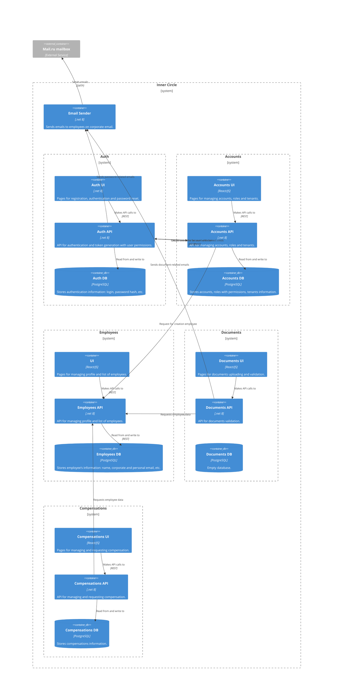

# inner-circle-documentation

## Links to all project repositories
- 
- 

## Containers Diagram 

```mermaid
C4Container
    Boundary(InnerCircleBoundary, "Inner Circle"){
        Boundary(AuthBoundary, "Auth") {
            Container(AuthUI, "Auth UI", ".net 8", "Pages for registration, authentication and password reset.")
            Container(AuthAPI, "Auth API", ".net 8", "API for authentication and token generation with user permissions.")
            ContainerDb(AuthDB, "Auth DB", "PostgreSQL", "Stores authentication information: login, password hash, etc.")
        }

        Boundary(AccountsBoundary, "Accounts") {
            Container(AccountsUI, "Accounts UI", "React/JS", "Pages for managing accounts, roles and tenants.")
            Container(AccountsAPI, "Accounts API", ".net 8", "API for managing accounts, roles and tenants.")
            ContainerDb(AccountsDB, "Accounts DB", "PostgreSQL", "Stores accounts, roles with permissions, tenants information.")
        }

        Boundary(EmployeesBoundary, "Employees") {
            Container(UI, "UI", "React/JS", "Pages for managing profile and list of employees.")
            Container(EmployeesAPI, "Employees API", ".net 8", "API for managing profile and list of employees.")
            ContainerDb(EmployeesDB, "Employees DB", "PostgreSQL", "Stores employee's information: name, corporate and personal email, etc.")
        }

        Boundary(DocumentsBoundary, "Documents") {
            Container(DocumentsUI, "Documents UI", "React/JS", "Pages for documents uploading and validation.")
            Container(DocumentsAPI, "Documents API", ".net 8", "API for documents validation.")
            ContainerDb(DocumentsDB, "Documents DB", "PostgreSQL", "Empty database.")
        }

        Boundary(CompensationsBoundary, "Compensations") {
            Container(CompensationsUI, "Compensations UI", "React/JS", "Pages for managing and requesting compensation.")
            Container(CompensationsAPI, "Compensations API", ".net 8", "API for managing and requesting compensation.")
            ContainerDb(CompensationsDB, "Compensations DB", "PostgreSQL", "Stores compensations information.")
        }

        Container(EmailSender, "Email Sender", ".net 8", "Sends emails to employees on corporate email.")
    }

    Container_Ext(MailBox, "Mail.ru mailbox", "External Service", "")

    Rel(AuthUI, AuthAPI, "Makes API calls to", "REST")
    Rel(AuthAPI, AccountsAPI, "Get permissions for user with correct creds", "REST")
    Rel(AccountsAPI, AuthAPI, "Create user after account creation", "REST")
    Rel(AuthAPI, AuthDB, "Read from and write to")
    Rel(AuthAPI, EmailSender, "Sends password-related emails")

    Rel(AccountsUI, AccountsAPI, "Makes API calls to", "REST")
    Rel(AccountsAPI, AccountsDB, "Read from and write to")
    Rel(AccountsAPI, EmployeesAPI, "Request for creation employee")

    Rel(EmployeesAPI, EmployeesDB, "Read from and write to", "REST")

    Rel(UI, EmployeesAPI, "Makes API calls to", "REST")


    Rel(DocumentsUI, DocumentsAPI, "Makes API calls to")
    Rel(DocumentsAPI, EmailSender, "Sends document-related emails")
    Rel(DocumentsAPI, EmployeesAPI, "Requests employee data")


    Rel(CompensationsUI, CompensationsAPI, "Makes API calls to", "REST")
    Rel(CompensationsAPI, CompensationsDB, "Read from and write to")
    Rel(CompensationsAPI, EmployeesAPI, "Requests employee data")

    Rel(EmailSender, MailBox, "Sends emails", "SMTP")
```
