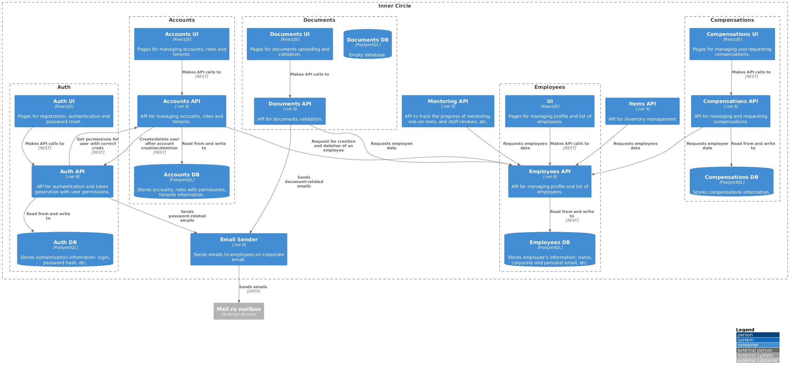

# inner-circle-documentation

## Links to all project repositories

| Repository                                                                                         | Comment    |
|----------------------------------------------------------------------------------------------------|------------|
| [auth-ui](https://github.com/TourmalineCore/auth-ui)                                               |            |
| [auth-api](https://github.com/TourmalineCore/auth-api)                                             |            |
| [accounts-ui](https://github.com/TourmalineCore/accounts-ui)                                       |            |
| [accounts-api](https://github.com/TourmalineCore/accounts-api)                                     |            |
| [inner-circle-documents-ui](https://github.com/TourmalineCore/inner-circle-documents-ui)           |            |
| [inner-circle-documents-api](https://github.com/TourmalineCore/inner-circle-documents-api)         |            |
| [inner-circle-ui](https://github.com/TourmalineCore/inner-circle-ui)                               |            |
| [inner-circle-employees-api](https://github.com/TourmalineCore/inner-circle-employees-api)         |            |
| [inner-circle-compensations-ui](https://github.com/TourmalineCore/inner-circle-compensations-ui)   |            |
| [inner-circle-compensations-api](https://github.com/TourmalineCore/inner-circle-compensations-api) |            |
| [inner-circle-email-sender](https://github.com/TourmalineCore/inner-circle-email-sender)           |            |
| [inner-circle-books-ui](https://github.com/TourmalineCore/inner-circle-books-ui)                   |            |
| [inner-circle-books-api](https://github.com/TourmalineCore/inner-circle-books-api)                 |            |
| [inner-circle-time-ui](https://github.com/TourmalineCore/inner-circle-time-ui)                     |            |
| [inner-circle-time-api](https://github.com/TourmalineCore/inner-circle-time-api)                   |            |
| [inner-circle-items-api](https://github.com/TourmalineCore/inner-circle-items-api)                 |            |
| [inner-circle-mentoring-api](https://github.com/TourmalineCore/inner-circle-mentoring-api)         |            |
| [inner-circle-layout-ui](https://github.com/TourmalineCore/inner-circle-layout-ui)                 |            |
| [inner-circle-local-env](https://github.com/TourmalineCore/inner-circle-local-env)                 |            |
| [inner-circle-reverse-proxy](https://github.com/TourmalineCore/inner-circle-reverse-proxy)         |            |

## Another useful links
- [Project board](https://github.com/orgs/TourmalineCore/projects/5)
- [USM board](https://board.mail.ru/?utm_source=portal&utm_medium=portal_navigation&utm_campaign=board.vk.com_cross_navimt_link_id%3Dykpiid2&uid=94acfbe7-8699-47d4-92df-fb705322e541)
- [Retro board](https://app.holst.so/board/047a6d87-4a7c-4179-840f-8c54f6fd21d2)
- [Figma designs](https://www.figma.com/design/O4Kbm638zRYHhVqN9FBm5D/Inner-Circle?t=kPjBwo15UyXLnic5-0)
- [Time Tracker Figma designs](https://www.figma.com/design/4e7YQWWIauDcFsN14EkAJr/Тайм-трекер?node-id=0-1&p=f&m=draw)
- [Design vs Propotype discussion board](https://app.holst.so/board/1629a6a2-f40c-488d-b038-7286e65fa4f4)

## C4 model

At the time the architectural diagrams were created, [Mermaid](https://mermaid.js.org/) did not yet fully and beautifully support C4 drawing. 
Therefore, [PlantUML](https://plantuml.com/en/stdlib) is used to draw C4 diagrams in this repository. Since C4 is not natively rendered with PlantUML in GitHub at the time the diagrams were published, the option of rendering the diagram as a photo is used, with the original `.puml` file with the diagrams saved in the `c4-architecture-diagrams` folder.

### Containers Diagram 

Note: To update this diagram, you need to open [site](https://www.plantuml.com/plantuml/uml/SyfFKj2rKt3CoKnELR1Io4ZDoSa700002) and paste the text from [c4-container.puml file](c4-architecture-diagrams/c4-container.puml), after correction copy the text and update c4-container.puml file, and  open the update link of diagram, save image and change it in c4-architecture-diagrams/images folder.
