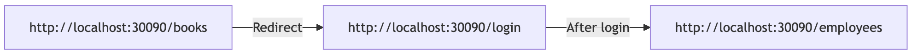
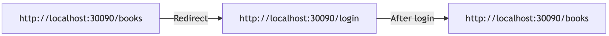

# 007: Post-Authorization Redirect Handling

## Status

Accepted (2026-07-24)

## Context

Currently, after successful authorization, users are redirected to ```/employees``` regardless of their original destination. 



This creates a poor user experience, particularly in scenarios like QR code scanning where users expect to land on a specific resource page after authentication.



## Desicion

Implement a **returnUrl** query parameter system with security validations to redirect users to their intended destination after login.

### Technical Implementation

1. **Authentication flow changes**</br>
Modify the ```useAuthenticated.ts``` file in the **auth-ui** service to use **returnUrl** from query parameters:

```javascript
// Before
window.location.href = '/employees'

// After
const returnUrl = new URLSearchParams(window.location.search).get('returnUrl')
window.location.href = returnUrl || '/'
```

2. **URL validation** to prevent Open Redirect vulnerabilities

Validate by parsing the URL and comparing its origin to the app's own origin:

```javascript
function isSafeReturnUrl(returnUrl) {
  try {
    const url = new URL(returnUrl, window.location.origin)
    return url.origin === window.location.origin
  } catch {
    return false
  }
}
```

If validation fails, fall back to "/".

**Why This Matters**

**Example attack (unsafe redirect after login):**

```http://localhost:30090/auth?returnUrl=http://attacker-site.com/fake-login```

A web app redirects the user to the URL in the **returnUrl** query parameter after login, without checking it.
The victim sees a malicious link that starts with our own host, so they trust it. Without validation, after login the app redirects them to the attacker's site, which can copy our UI and steal the victim's credentials.

**With validation:**
```javascript
isSafeReturnUrl("http://attacker-site.com/fake-login")
// new URL(...).origin === "http://attacker-site.com"
// "http://attacker-site.com" !== "http://localhost:30090" -> false
// falls back to "/"
```

**Legitimate case:** returning to the book copy page after login via QR scan, passes validation and works correctly:

```javascript
isSafeReturnUrl("http://localhost:30090/copy/1?s=2222")
// origin "http://localhost:30090" === "http://localhost:30090" -> true
// redirects to the book copy page
```

Our site runs on a single host, so it's enough to check that the redirect stays on that host.

#### Alternative
An earlier version used string matching: ```returnUrl.startsWith("http://localhost:30090/")```

#### Advantages:
- trailing slash blocks the obvious domain-spoofing trick (```http://localhost:30090.bad-domain.com```)

#### Disadvatnages: 
- plain string-prefix check is still weaker than parsing the URL and comparing origins, as a string can be read differently from hown the browser reads it
- browsers always lowercase the scheme and host when parsing a URL, but ```startsWith``` does not. This could cause legitimate redirects to fail in edge cases:

```javascript
new URL('HTTP://LocalHost:30090/employees').origin === 'http://localhost:30090' // -> true -> /employees
'HTTP://LocalHost:30090/employees'.startsWith('http://localhost:30090/')  // -> false -> /
```

3. **Nested redirect protection**

If any page on our own site does its own unsafe redirect from its own query parameter, an attacker could set a nested **returnUrl**, and the page with such redirect chain could redirect off-site.

**Example of nested redirect attack:**

```http://localhost:30090/auth?returnUrl=http://localhost:30090/some-page?returnUrl=http://evil.com```

This passes every origin check, but the user still ends up off our site once that internal page runs its own redirect.

To guard against this, extend **isSafeReturnUrl** to also reject a **returnUrl** whose own query string contains another **returnUrl** parameter nested inside it. If one is found, treat the URL as unsafe and fall back to "/":

```javascript
function isSafeReturnUrl(returnUrl) {
  try {
    const url = new URL(returnUrl, window.location.origin)
    if (url.origin !== window.location.origin) return false
    // Block nested redirects
    if (url.searchParams.has('returnUrl')) return false
    return true
  } catch {
    return false
  }
}
```

**Example**:

```javascript
isSafeReturnUrl("http://localhost:30090/some-page?returnUrl=http://evil.com")
// origin check passes, but it has a nested "returnUrl" param -> false
// falls back to "/"
```

This fix only catches redirects built with the **returnUrl** name. You should either be very careful or make sure that no page on our site other than the login page performs its own unchecked redirect from a query parameter.

**References**:
- [OWASP Cheat Sheet — Unvalidated Redirects and Forwards](https://cheatsheetseries.owasp.org/cheatsheets/Unvalidated_Redirects_and_Forwards_Cheat_Sheet.html)
- [OWASP — Open Redirect](https://owasp.org/www-community/attacks/open_redirect) (listed under Broken Access Control, A01 in the OWASP Top 10)

4. **Encoding in redirect URLs**

In each UI service's RequireAccessToken file, replace:

```javascript
// Before
window.location.href = '/auth'

// After
window.location.href = `/auth?returnUrl=${encodeURIComponent(window.location.href)}`
```

Why ```encodeURIComponent``` is required? It preserves multi-parameter URLs.

Without ```encodeURIComponent```:

```http://localhost:30090/auth?returnUrl=http://localhost:30090/books?copyId=1&s=2222```

The ```&``` is parsed as a delimiter, so the URL becomes:

- ```returnUrl``` = ```http://localhost:30090/books?copyId=1```

- ```s``` = ```2222``` (lost/truncated)

With ```encodeURIComponent```:

```
`http://localhost:30090/auth?returnUrl=${encodeURIComponent(window.location.href)}`
// http://localhost:30090/auth?returnUrl=http%3A%2F%2Flocalhost%3A30090%2Fbooks%2Fcopy%2F1%3FcopyId%3D1%26s%3D2epq
```
The ```&``` inside the value is now encoded (```%26```), so it's not confused with the outer query parameters, and auth-ui restores the complete original URL correctly.
