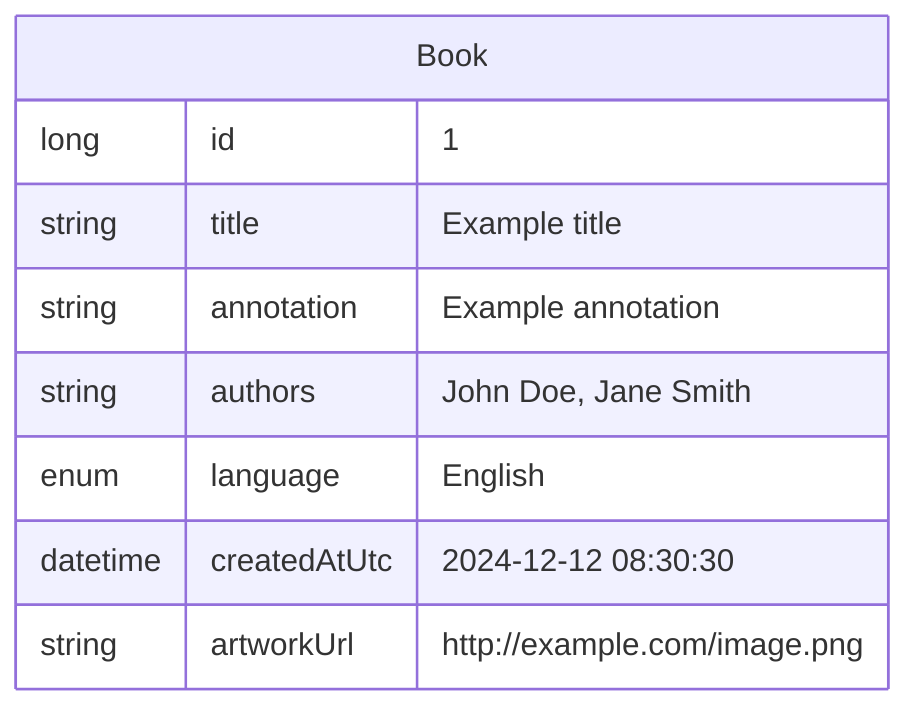
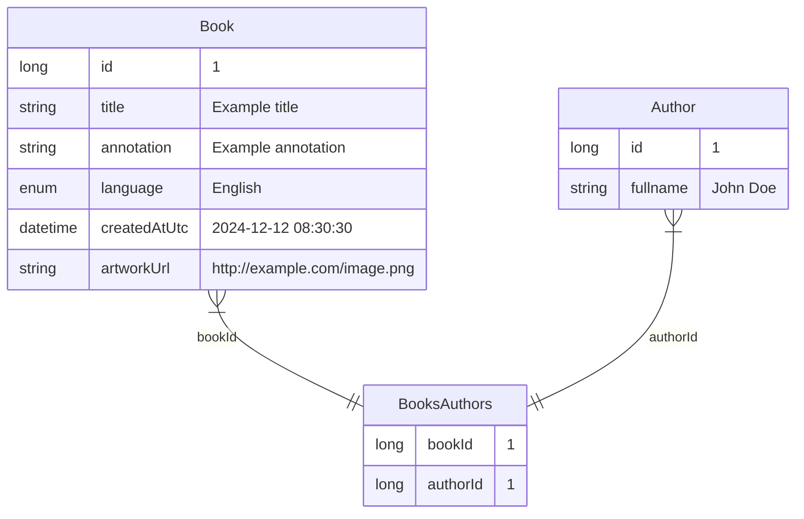

# How to store book authors in the database?

## Status
Proposed

## Context
We have a book and we have an author/authors of this book. How should we store information about author/authors?

## Alternatives
### One alternative
As string in the “Book” table - store fullnames as a string array.

#### Pros
- There will be no need to implement cascading deletion/editing when deleting/editing a book;
- Few people write more than 1 book from technical authors, a dictionary with authors **for our** library will not be reused often.
#### Cons
- If we decide to put the authors in a separate table, then we have to pull authors from all the books, remove the duplicates, fill a separate table with those authors, and then link those authors to their books;
- If we decide to search by author, it will be more difficult to get a list of all authors, because they are in the table with books, are the value of one row (if there are several, they are separated by a comma or colon) and can be duplicated in several books at once;
- If there is a mistake in the author's name, you will have to correct it in each book separately.
### Two alternative
As a different table named “Author” with M:M relation to “Book” table.

#### Pros
- If we need to search for a book by author, it is easier to get the full list of authors for the drop-down list by using the SELECT command on the “Authors” table;
- When searching for an author through the search bar, we will not depend on the database provider;
- If you need to correct a mistake in the name of an author who owns several books, just edit his name in the "Author" table.

#### Cons
- It is necessary to correctly implement the deletion of entities in order not to delete books by deleting the author and vice versa;
- It is still unclear whether a filter by the author will be needed;
## Decision
?