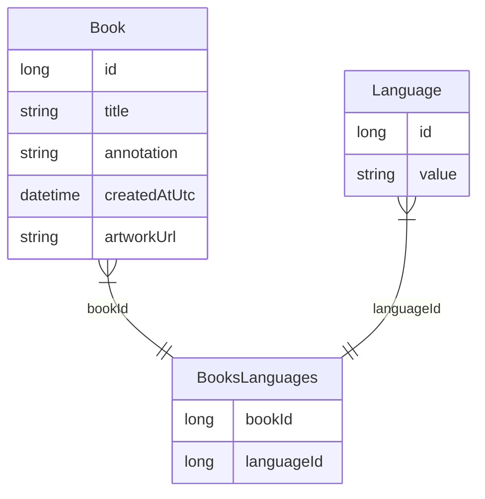

# Storing the book language in a database

## Status
Proposed

## Context
We need to specify language for the book, which we will add to the system. We have to decide how we will store this information in the database.

## Alternatives

### One alternative
Create a “Language” table and add a language to the book as language_id.

#### Pros
- Following the third normal db form - if the data of one table changes, the data in the related tables will also change.
#### Cons
- There are no more than 2 languages of books at the moment and in the near;
- In "Language" table we don't need to rename some language and there are no plans to add languages in the near future.
### Two alternative
Use enum to store languages.
#### Pros
- No need to create requests to database for creating new language or delete it;
- Following this [code](https://learn.microsoft.com/en-us/ef/core/modeling/value-conversions?tabs=data-annotations) we can store language as string (value of enum).
#### Cons
- If we use an enumeration, then without additional code its values in the database are stored as id and it complicates the perception of information when viewing the database, because there is no decoding of the value of this id.
## Decision
We decided to use enum, because using a separate table for values that are not changed, deleted or new is not reasonable.
