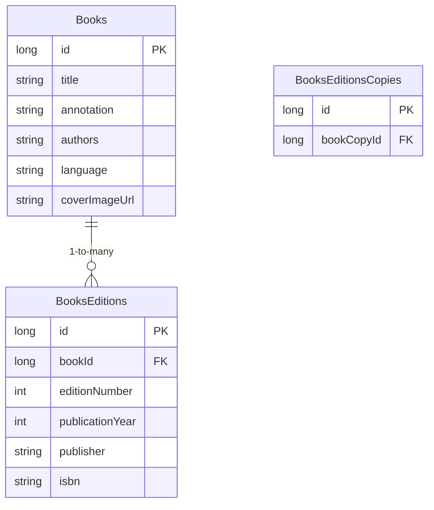
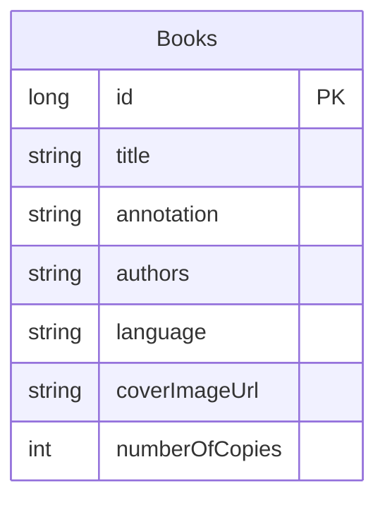
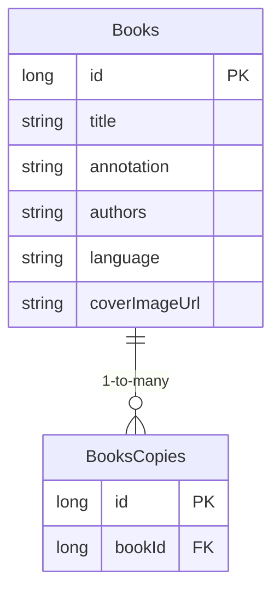
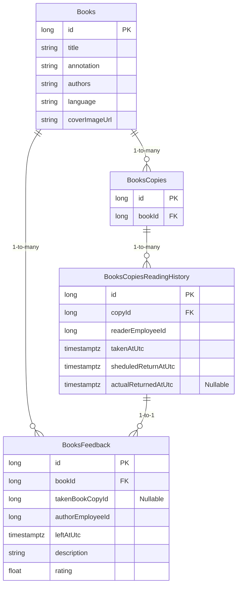
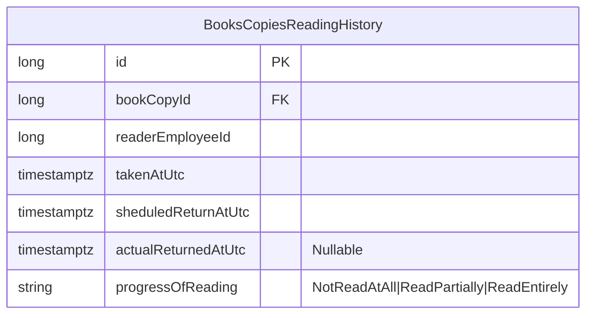

# Book Copies ADR

## Status

Proposed

## Context

In books service, we are going to store information about books that are in the office. We have several copies of several books. We need to store information about the number of copies of books in general and about copies that are taken by employees or available in the office.

## Functional Nuances

- Book Edition - it is possible that there is an older book edition in the office and the newer one. We are going to treat them as separate books. In this case we are going to leave comments for different editions of the same book separately. Books editions aren't linked in the service, they are completely independent frm each other.
- Some books are owned by employees. Thus, if an employee quits this person takes their books with them. We don't track personal books in the system (???).
- If I try to take an already taken book than it should be automatically returned by its previous holder and taken by me. This should be helpful when a person forgot to mark a book as returned when left it in the office after it was read.

## Domain Terms

- Book
- Book Copy

## Alternatives 

### 1. We need to track each copy of a book separately. That means that a Book Copy is a domain entity and has its own Id. We also have Edition as a domain entity.

#### Pros

1. We can support the same edition of different years of the same book.
2. Copy is very specific at max.

#### Cons

1. Too much of complexity but not sure about the value.

### 2. We track only the number of a book copies in the office. Thus, we we manipulate over the book itself, and not using its copy.

#### Pros

1. Single table - very simple to use.

#### Cons

1. We cannot distinquish two different copies of a book. QR codes will lead to the same book.
2. Cannot natively split book copies by their reading status.

### 3. We need to track each copy of a book separately. That means that a Book Copy is a domain entity and has its own Id.

#### Pros

1. We can use bookCopyId as an ID for QR codes URL. /books?bookCopyId=7. Thus, we know which copy of a book we scanned.
2. Ok from normalization forms point of view.
3. We have to think in Domain Terms (Ubiquitous Language).

#### Cons

1. More complex flow to think of a Book or a BookCopy in the code. If we have just Books, it is sort of easier.

## Decision

We stick to the last approach with Books and BooksCopies tables. We operate over `bookId` and `bookCopyId` in different scenarios.

## Notes

for future BooksCopiesReadingHistory maybe will be like (added progressOfReading prop)
