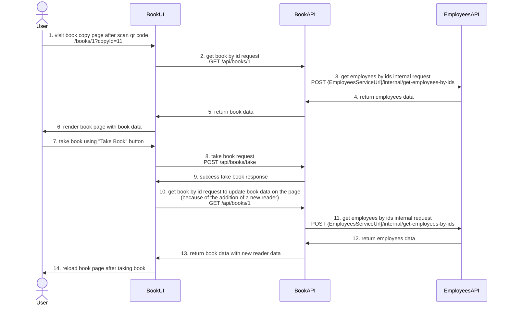

# Take Book Contract

### Take book request - POST /api/books/take

Request body:

```ts
{
  bookCopyId: 1,
  scheduledReturnDate: `2025-11-22`
}
```

Response - void

### Get book by id request - GET /api/books/{id}

Now getting a book looks like this

```ts
{
  id: 1,
  title: `ChatGPT мастер подсказок или как создавать сильные промты  для нейросети`,
  annotation: `annotation`,
  language: `ru`,
  authors: [
    {
      fullName: `authors`, 
    },
  ],
  coverUrl: ``,
  bookCopiesIds: [ 
    11, 
    12,
  ],
}
```

But after adding take book flow, the page also needs to display who has the book in their hands (now it will be list of fullNames), and if the user who has the book in their hands has visited the book page, this also needs to be understood

```ts
{
  id: 1,
  title: `ChatGPT мастер подсказок или как создавать сильные промты  для нейросети`,
  annotation: `annotation`,
  language: `ru`,
  authors: [
    {
      fullName: `authors`, 
    },
  ],
  coverUrl: ``,
  bookCopiesIds: [ 
    11, 
    12, 
  ],
  readers: [
    {
      employeeId: 1,
      fullName: "Ivanov Ivan", // for now to display who has the book in their hands
      // photo: // later to display who has the book in their hands instead of fullName
    },
  ],
}
```

### Get employees by ids internal request - POST {EmployeesServiceUrl}/internal/get-employees-by-ids

Request body:

```ts
{
    employeesIds: [
      21, 
      32
    ]
}
```
 
Response:

```ts
{
    employees: [
        {
            employeeId: 21,
            fullName: "Ivanov Ivan"
        },
        {
            employeeId: 32,
            fullName: "Petrov Petr"
        },
    ]
}
```

### Sequence Diagram for take book contract


