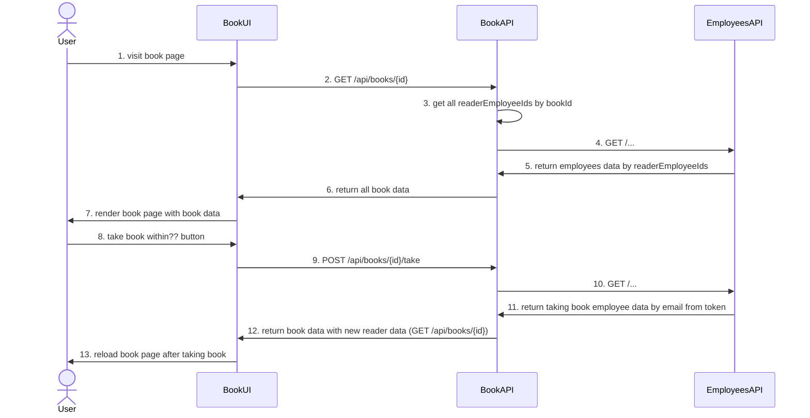

# Take Book Contract

### POST /api/books/take

Request body:
```ts
{
  bookCopyId: 1,
  takenAtUtc: `15.08.2025`
  sheduledReturnAtUtc: `22.11.2025`
  // readersIds: [
  //   {
  //     corporateEmail: "iivanov1@mail.com",
  //   },
  //   {
  //     corporateEmail: "iivanov2@mail.com",
  //   },
  // ]
}
```

Response
```ts
{
  takenBookId: 1,
}
```

### GET /api/books/{id}

Now getting a book looks like this

```ts
{
  id: 1,
  title: `ChatGPT мастер подсказок или как создавать сильные промты  для нейросети`,
  annotation: `annotation`,
  language: `ru`,
  authors: [
    {
      fullName: `authors`, 
    },
  ],
  bookCoverUrl: ``,
  bookCopies: [ 
    11, 
    12,
  ],
}
```

But after adding take book flow, the page also needs to display who has the book in their hands (now it will be list of fullNames), and if the user who has the book in their hands has visited the book page, this also needs to be understood

```ts
{
  id: 1,
  title: `ChatGPT мастер подсказок или как создавать сильные промты  для нейросети`,
  annotation: `annotation`,
  language: `ru`,
  authors: [
    {
      fullName: `authors`, 
    },
  ],
  сoverUrl: ``,
  bookCopiesIds: [ 
    11, 
    12, 
  ],
  readers: [
    {
      employeeId: 1,
      fullName: "Ivanov Ivan", // for now to display who has the book in their hands
      corporateEmail: "iivanov3@mail.com", // for understand that the user who has the book in their hands has visited the book page
      // photo: // later to display who has the book in their hands instead of fullName
    },
  ],
}
```

### Sequence Diagram for take book contract



----
на подумать можно ли сделать так чтобы первые 2 ридера которые были на странице изначально запомнились и в запросе пришли только данные по новому ридеру и отрисовались уже трое