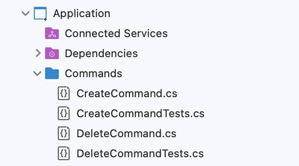

# API Code Style

This document outlines the code style guidelines for API services.

## Run, Debug, and Test in Dev Container VSCode/Codespaces

This section contains insructions on how to run, debug, and test the API in Dev Container in VSCode and GitHub Codespaces.

By default `db` and `mock-server` start at Dev Container startup. Thus, the only thing you need to do is to run the API itself.

### Simple Run
You can run the API executing the following script in Terminal:
```cli
dotnet run --project ./Api
```
>Docs: [dotnet run](https://learn.microsoft.com/en-us/dotnet/core/tools/dotnet-run).

We don't specify configuration because Dev Container contains `ASPNETCORE_ENVIRONMENT` env var with `MockForDevelopment` to make the start command short and use this configuration everywhere else by default.

### Simple Testing

#### Rest Client
The simplest way you can test the API is using `*.http` requests collections for Rest Client. For instance, use `App.http` to generate a debug auth token using running `mock-sever` and calling the API endpoints with it.

>Docs: [Rest Client with Examples of Requests](https://marketplace.visualstudio.com/items?itemName=humao.rest-client).

#### xUnit Tests

To run xUnit unit and integrational tests execute the following script in Terminal:
```cli
dotnet test --verbosity detailed
```

#### Karate Tests

To run Karate E2E tests execute the following script in Terminal:
```cli
java -jar /karate.jar .
```

## Configurations

- DbOnly - spins up only database in docker compose, especially useful to add migrations
- MockForDevelopment - used locally when you run the service in Visual Studio e.g. in Debug and don't want to spin up any external deps
- MockForTests - used locally to run the service in isolation (no external deps) and later separately run its Karate tests
- MockForPullRequest - used in PR pipeline to run the service in isolation (no external deps) and its Karate tests
- LocalEnvForDevelopment - used locally when you run the service in Visual Studio and you want to connect to its external deps from Local Env, including Local Env's running api's database. Thus locally running api and Local Env api target the same db and the same dependent services from Local Env
- LocalEnvForPullRequest - used in PR pipeline to run the service as part of Local Env and later separately run Karate tests against it

| Configuration              | Db in Docker Compose | Api in Docker Compose | Api in Local Env | MockServer for External Deps |  Local Env for External Deps | Run Karate Tests |
| :---------------- | :------: | :------: | :------: | :------: | :------: | :------: |
| DbOnly                 |   Yes   |   No   |   No   |   No   |   No   |   No   |
| MockForDevelopment     |   Yes   |   No   |   No   |   Yes  |   No   |   No   |
| MockForTests           |   Yes   |   Yes  |   No   |   Yes  |   No   |   No   |
| MockForPullRequest     |   Yes   |   Yes  |   No   |   Yes  |   No   |   Yes  |
| LocalEnvForDevelopment |   No    |   No   |   Yes  |   No   |   Yes  |   No   |
| LocalEnvForPullRequest |   No    |   No   |   Yes  |   No   |   Yes  |   Yes  |

## Ports

You need to book ports before adding services in this docs table (ToDo move from here).

The key take away is to provide a convention to make a conscious decision about ports for a new service and enable all product services parallel run on a developer's computer.

When you add a new service you need to add a new row at the end of this table as a copy of the previous one and increment each port by 1. For instance, the last service ports were: 4501, 5501, 6501, 7501, 8501 => the new ones will be 4502, 5502, 6502, 7502, 8502.

This approach should be scalable to make other products using this infra and approaches. In case of a new product we might use not 500 but 600. So the first service ports will be: 4601, 5601, 6601, 7601, 8601.

### Local
| Service Name               | Api in Dev Container/Codespaces | Api in IDE | Api in Docker Compose |  Db in Docker Compose |MockServer in Docker Compose |
| :------------------------- | :-----------------------------: | :--------: | :-------------------: | :-------------------: | :-------------------------: |
| inner-circle-items-api     |               4501              |    5501    |          6501         |          7501         |             8501            |
| inner-circle-mentoring-api |               4502              |    5502    |          6502         |          7502         |             8502            |
| auth-api                   |               4503              |    5503    |          6503         |          7503         |             8503            |
| inner-circle-documents-api |               4504              |    5504    |          6504         |          7504         |             8504            |
| inner-circle-books-api     |               4505              |    5505    |          6505         |          7505         |             8505            |


## 1. Layers Structure

Now we agreed to use 3 layers:

1. **Api**

- This layer contains controllers, requests and responses. This helps to group all request-related code within the Api context.

2. **Application**

- Here lies the business logic, including commands, queries, and mapping with DbContext.

3. **Core**

- This layer contains classes that describe entities. These classes are used in DbContext to create tables. We do not return Core classes to user or perform any operations with them. 
   
   Our **Application** layer accepts models, transforms them into Core classes in commands, and saves them in the database. Similarly, queries extract Core classes from the database but immediately convert them into models for passing up (for example, to responses).


## 2. Test location

We place unit-tests next to the classes they test on all layers of the application. You can read [our article](https://www.tourmalinecore.com/articles/dotnet-unit-testing) about it. For example, in the **Application** layer, commands are placed alongside their corresponding tests, as shown in the image below:




## 3. Naming Convention of Methods That Return Tasks

All methods that return tasks must end with `Async`.

```csharp
public async Task DoSomethingAsync()
```


## 4. Controller Responses Naming

Everything that comes back from the controller must end with `Response`.

```csharp
public async Task<SomeElseResponse> DoSomethingElseAsync()
```


## 5. Explicit Response Mapping

In the controller, explicit mapping of data should always occur before returning the response.

```csharp
public async Task<CreateResponse> CreateAsync(CreateRequest createRequest)
{
    var createCommandParams = new CreateCommandParams
    {
        FirstParam = createRequest.FirstParam,
        SecondParam = createRequest.SecondParam,
    };

    var newId = await _createCommand.CreateAsync(createCommandParams);

    return new CreateResponse()
    {
        NewId = newId
    };
}
```


## 6. RORO pattern

We use RORO pattern (Request Object Response Object). You can read 
[our article](https://www.tourmalinecore.com/articles/React) about it.

---
to be continued..
