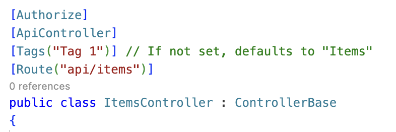
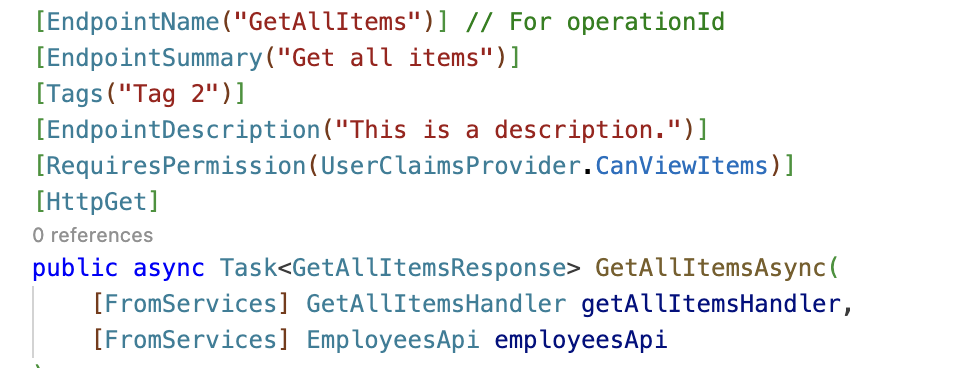
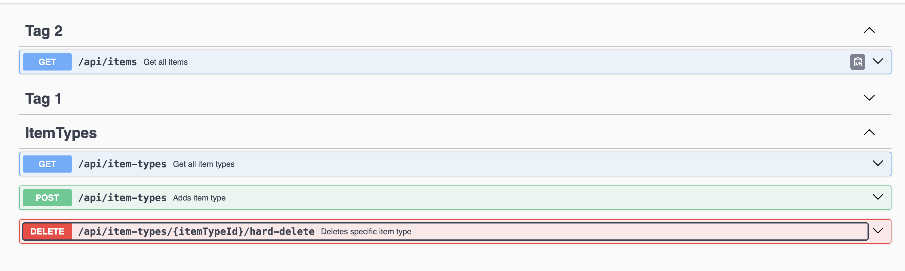
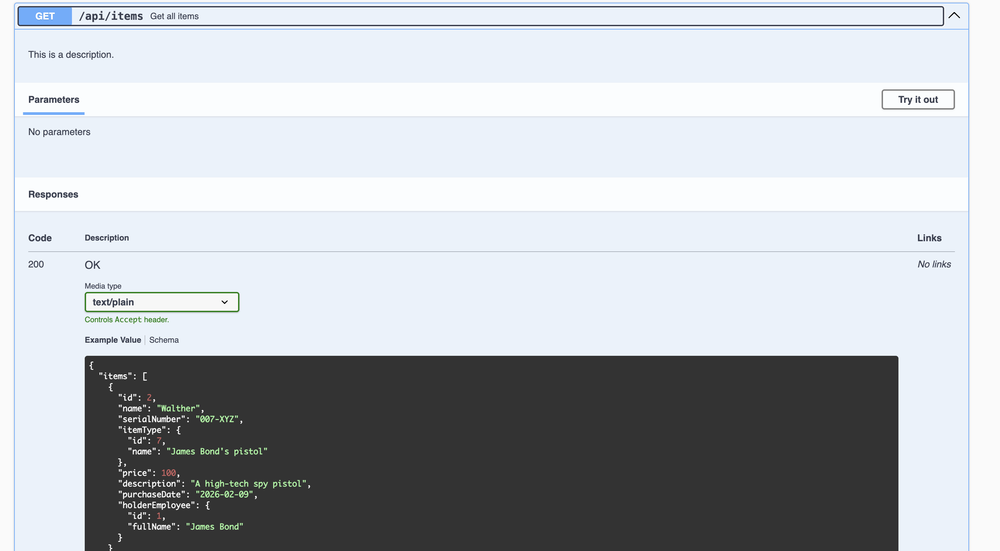
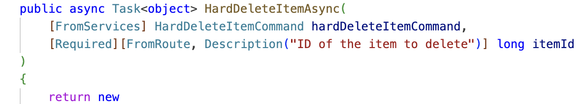
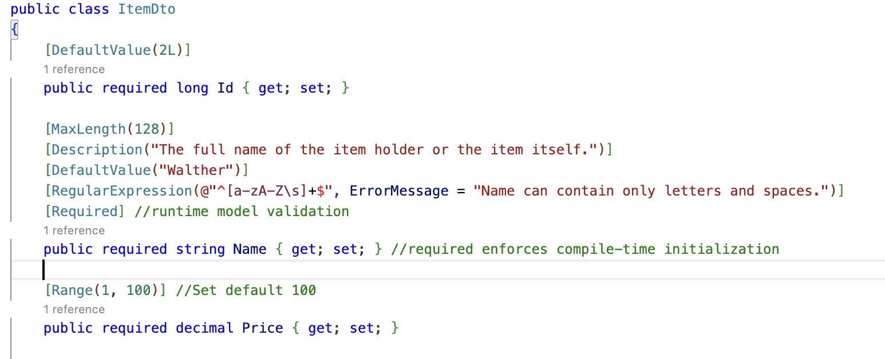
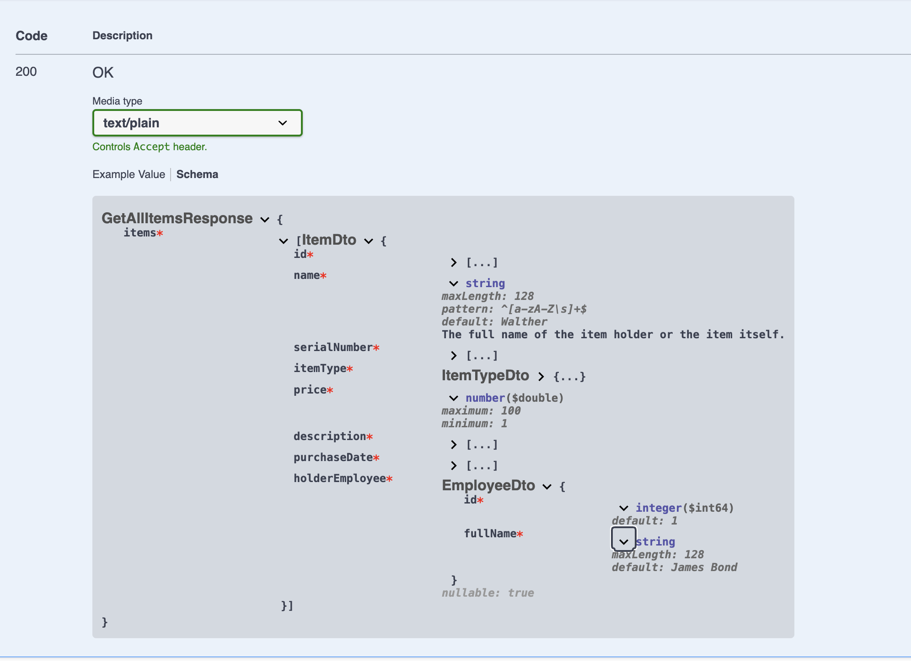

# API Code Style

This document outlines the code style guidelines for API services.

## Develop in Dev Container VSCode/Codespaces

This section contains insructions on how to run, debug, and test the API in Dev Container in VSCode and GitHub Codespaces.

Super useful guidelinse about C#/.NET development in VSCode available [here](https://code.visualstudio.com/docs/csharp/introvideos-csharp) and all its other chapters of C# section.

By default `db` and `mock-server` start at Dev Container startup. Thus, the only thing you need to do is to run the API itself.

### Simple Run
You can run the API executing the following script in Terminal:
```cli
dotnet run --project ./Api
```
>Docs: [dotnet run](https://learn.microsoft.com/en-us/dotnet/core/tools/dotnet-run).

We don't specify configuration because Dev Container contains `ASPNETCORE_ENVIRONMENT` env var with `MockForDevelopment` to make the start command short and use this configuration everywhere else by default.

### Simple Testing

#### Rest Client
The simplest way you can test the API is using `*.http` requests collections for Rest Client. For instance, use `App.http` to generate a debug auth token using running `mock-sever` and calling the API endpoints with it.

>Docs: [Rest Client with Examples of Requests](https://marketplace.visualstudio.com/items?itemName=humao.rest-client).

#### xUnit Tests

To run xUnit unit and integrational tests execute the following script in Terminal:
```cli
dotnet test --verbosity detailed
```

#### Karate Tests

To run Karate E2E tests execute the following script in Terminal:
```cli
java -jar /karate.jar .
```

### Migrations

Go through [these](https://learn.microsoft.com/en-us/ef/core/managing-schemas/migrations/?tabs=dotnet-core-cli) Migrations chapters to pick up some basic understanding of Migrations.

Connection string is taken from `MockForDevelopment` configuration due to `ASPNETCORE_ENVIRONMENT` env variable in `removeEnv` of Dev Container. 

#### Add Migration

To add a new migration with the domain changes execute the following script in Terminal:
```cli
dotnet ef migrations add <YOUR_NEW_MIGRATION_NAME> --startup-project ./Api/Api.csproj --project ./Application/Application.csproj --context AppDbContext --verbose
```

#### Remove Migration

To remove the last migration execute the following script in Terminal:
```cli
dotnet ef migrations remove --startup-project ./Api/Api.csproj --project ./Application/Application.csproj --context AppDbContext --verbose
```
>Note: You cannot do that if this migration applied to production!

#### Update Database

To apply pending migrations execute the following script in Terminal:
```cli
dotnet ef database update --startup-project ./Api/Api.csproj --project ./Application/Application.csproj --context AppDbContext --verbose
```

## Configurations

- DbOnly - spins up only database and its pgAdmin in docker compose, especially useful to add migrations
- MockForDevelopment - used locally when you run the service in Visual Studio e.g. in Debug and don't want to spin up any external deps
- MockForTests - used locally to run the service in isolation (no external deps) and later separately run its Karate tests
- MockForPullRequest - used in PR pipeline to run the service in isolation (no external deps) and its Karate tests
- LocalEnvForDevelopment - used locally when you run the service in Visual Studio and you want to connect to its external deps from Local Env, including Local Env's running api's database. Thus locally running api and Local Env api target the same db and the same dependent services from Local Env
- LocalEnvForPullRequest - used in PR pipeline to run the service as part of Local Env and later separately run Karate tests against it

| Configuration              | Db in Docker Compose | Api in Docker Compose | Api in Local Env | MockServer for External Deps |  Local Env for External Deps | Run Karate Tests | PgAdmin |
| :---------------- | :------: | :------: | :------: | :------: | :------: | :------: | :------: |
| DbOnly                 |   Yes   |   No   |   No   |   No   |   No   |   No   |   Yes  |
| MockForDevelopment     |   Yes   |   No   |   No   |   Yes  |   No   |   No   |   Yes  |
| MockForTests           |   Yes   |   Yes  |   No   |   Yes  |   No   |   No   |   No   |
| MockForPullRequest     |   Yes   |   Yes  |   No   |   Yes  |   No   |   Yes  |   No   |
| LocalEnvForDevelopment |   No    |   No   |   Yes  |   No   |   Yes  |   No   |   No   |
| LocalEnvForPullRequest |   No    |   No   |   Yes  |   No   |   Yes  |   Yes  |   No   |

## Ports

You need to book ports before adding services in this docs table (ToDo move from here).

The key take away is to provide a convention to make a conscious decision about ports for a new service and enable all product services parallel run on a developer's computer.

When you add a new service you need to add a new row at the end of this table as a copy of the previous one and increment each port by 1. For instance, the last service ports were: 4501, 5501, 6501, 7501, 8501, 9501 => the new ones will be 4502, 5502, 6502, 7502, 8502, 9502.

This approach should be scalable to make other products using this infra and approaches. In case of a new product we might use not 500 but 600. So the first service ports will be: 4601, 5601, 6601, 7601, 8601, 9601.

### Local
| Service Name               | Api in Dev Container/Codespaces | Api in IDE | Api in Docker Compose |  Db in Docker Compose | MockServer in Docker Compose | PgAdmin in Docker Compose |
| :------------------------- | :-----------------------------: | :--------: | :-------------------: | :-------------------: | :-------------------------: | :-------------------------: |
| inner-circle-items-api     |               4501              |    5501    |          6501         |          7501         |             8501            |             9501            |
| inner-circle-mentoring-api |               4502              |    5502    |          6502         |          7502         |             8502            |             9502            |
| auth-api                   |               4503              |    5503    |          6503         |          7503         |             8503            |             9503            |
| inner-circle-documents-api |               4504              |    5504    |          6504         |          7504         |             8504            |             9504            |
| inner-circle-books-api     |               4505              |    5505    |          6505         |          7505         |             8505            |             9505            |
| inner-circle-employees-api     |               4506              |    5506    |          6506         |          7506         |             8506     | 9506
| inner-circle-time-api      |               4507              |    5507    |          6507         |          7507         |             8507     | 9507

## 1. Layers Structure

Now we agreed to use 3 layers:

1. **Api**

- This layer contains controllers, requests and responses. This helps to group all request-related code within the Api context.

2. **Application**

- Here lies the business logic, including commands, queries, and mapping with DbContext.

3. **Core**

- This layer contains classes that describe entities. These classes are used in DbContext to create tables. We do not return Core classes to user or perform any operations with them. 
   
   Our **Application** layer accepts models, transforms them into Core classes in commands, and saves them in the database. Similarly, queries extract Core classes from the database but immediately convert them into models for passing up (for example, to responses).


## 2. Test location

We place unit-tests next to the classes they test on all layers of the application. You can read [our article](https://www.tourmalinecore.com/articles/dotnet-unit-testing) about it. For example, in the **Application** layer, commands are placed alongside their corresponding tests, as shown in the image below:


## 3. Naming Convention of Methods That Return Tasks

All methods that return tasks must end with `Async`.

```csharp
public async Task DoSomethingAsync()
```


## 4. Controller Responses Naming

Everything that comes back from the controller must end with `Response`.

```csharp
public async Task<SomeElseResponse> DoSomethingElseAsync()
```


## 5. Explicit Response Mapping

In the controller, explicit mapping of data should always occur before returning the response.

```csharp
public async Task<CreateResponse> CreateAsync(CreateRequest createRequest)
{
    var createCommandParams = new CreateCommandParams
    {
        FirstParam = createRequest.FirstParam,
        SecondParam = createRequest.SecondParam,
    };

    var newId = await _createCommand.CreateAsync(createCommandParams);

    return new CreateResponse()
    {
        NewId = newId
    };
}
```


## 6. RORO pattern

We use RORO pattern (Request Object Response Object). You can read 
[our article](https://www.tourmalinecore.com/articles/React) about it.


## 7. DTO Naming for Response Models

All classes used in API responses must have the Dto postfix in their class names. This convention should help us to better distinguish domain entities from their alter egos that are here to be transferred via network which DTO (Data Transfer Object) means in essence. 

```csharp
public class ProjectsResponse
{
    public required List<ProjectDto> Projects { get; set; }
}

public class ProjectDto
{
    public required long Id { get; set; }

    public required string Name { get; set; }
}
```


## 8. Separate DTOs for Requests and Responses

Don't use shared DTO for different requests and responses. Even if they share the same fields.
In the future DTOs are likely to become different.

### Avoid using shared DTO between different Responses and Requests

```csharp
public class GetItemsResponse : ItemDto
{
    public required List<ItemDto> Items { get; set; }
}
```

```csharp
public class GetItemTypesResponse : ItemDto
{
    public required List<ItemDto> ItemTypes { get; set; }
}
```

### Create separate DTOs 

```csharp
public class GetItemsResponse
{
    public required List<ItemDto> Items { get; set; }
}

public class ItemDto
{
    public required long Id { get; set; }

    public required string Title { get; set; }

    public required string Description { get; set; }
}
```

```csharp
public class GetItemTypesResponse
{
    public required List<ItemTypesDto> ItemTypes { get; set; }
}

public class ItemTypesDto
{
    public required long Id { get; set; }

    public required string Title { get; set; }

    public required string Description { get; set; }
}
```


## 9. Lambda Parameter Naming

- Use `x` as the default lambda parameter name.
- Use a full, meaningful name only when it improves readability.
- Do not use abbreviated names.

### Avoid Abbreviated Naming

```csharp
items.Where(i => i.IsActive);
```

### Use `x` as default

```csharp
items.Where(x => x.IsActive);
```

### Use full name when it improves readability

```csharp
var result = orders
    .Where(order => order.IsPaid && order.CreatedAt >= startDate)
    .GroupBy(order => order.CustomerId)
    .Select(group => new
    {
        CustomerId = group.Key,
        OrdersCount = group.Count()
    });
```


## 10. Async Methods and Returning Tasks

- Methods that perform `await` inside must be marked as `async`.

- All methods that return a `Task` must have the `Async` postfix, even if they do not use `await` inside.

- If a method does not `await` anything inside, you can return the `Task` directly without marking the method `async`. This allows the caller to await it.

### Returning Task Directly (No Await)

```csharp
public Task<int> GetValueAsync()
{
    return _service.CalculateAsync();
}
```

### Async Method with Await

```csharp
public async Task<int> GetProcessedValueAsync()
{
    var result = await _service.CalculateAsync();
    return result + 1;
}
```


## 11. Null-Forgiving Operator (!)

When the linter reports possible null, use the null-forgiving operator `!.`

We assume the value always exists.
If it is null, the code should fail immediately.

Do not use `?.` in these cases. However, there are cases when `?.` is what you need, when null is possible and expected to happen. Thus, we use a stronger operator `!.` by default and a weaker one `?.` only when necessary.

```csharp
var value = context.User!.Id;
```

---
to be continued..


## 12. API Documentation for Swagger / OpenAPI

We use built-in ASP.NET Core features to add metadata to OpenAPI (Swagger).
This allows us to describe the API directly in code, without XML comments or third-party libraries.

[Official documentation](https://learn.microsoft.com/en-us/aspnet/core/fundamentals/openapi/include-metadata?view=aspnetcore-10.0&tabs=minimal-apis)

### Controller-level attributes



`[Tags("Tag 1")]`  
Sets the default OpenAPI tag for all endpoints in the controller.
Used for grouping endpoints in Swagger UI.

### Endpoint-level attributes



`[EndpointName("GetAllItems")]`  
Sets the operationId in the OpenAPI specification.

`[EndpointSummary("Get all items")]`  
Provides a short summary displayed in Swagger UI.

`[EndpointDescription("This is a description.")]`  
Provides a detailed description of the endpoint.

`[Tags("Tag 2")]`  
Overrides or adds OpenAPI tags for this specific endpoint.

### How this metadata appears in Swagger UI:




### Parameter description

`[Description("ID of the item to delete")]`  
Adds a human-readable description to an endpoint parameter.



### How this metadata appears in Swagger UI:


### DTO field metadata



Data annotations on DTO properties are used both for runtime validation and for enriching the OpenAPI (Swagger) schema.

`[Description(...)]`  
Adds a descriptive text for the field.  

`[DefaultValue("Walther")]`, `[DefaultValue(2L)]`  
Defines an example/default value for the field in the OpenAPI schema.  
Useful for Swagger UI examples and documentation (does not enforce runtime defaults).

`[MaxLength(128)]`  
Adds a maximum length constraint.

`[RegularExpression(...)]`  
Documents and enforces a validation rule for the field.  
Appears as a regex pattern.

`[Range(1, 100)]`  
Restricts allowed numeric values and is exposed as `minimum` / `maximum`.

`[Required]`  
Ensures a property has a value at runtime and is marked required in Swagger. Unlike C# required, [Required] does not enforce compile-time initialization - it only works during runtime validation.

### How this metadata appears in Swagger UI:


---
to be continued..