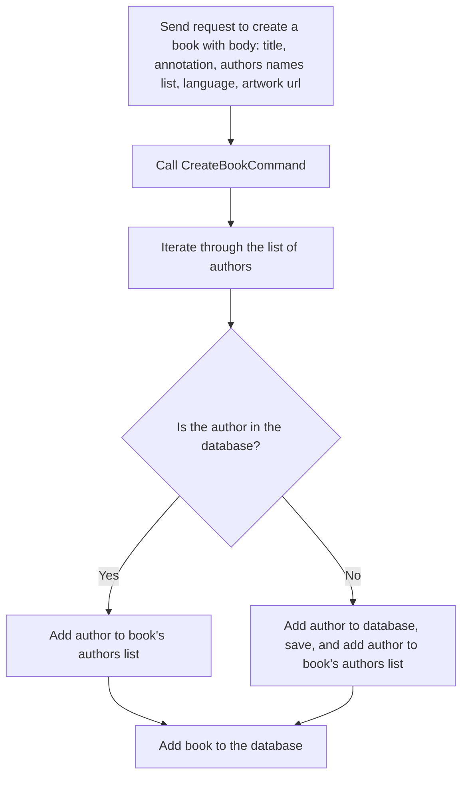
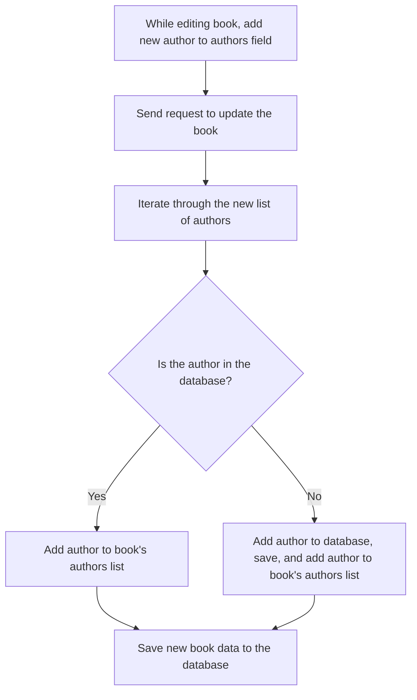
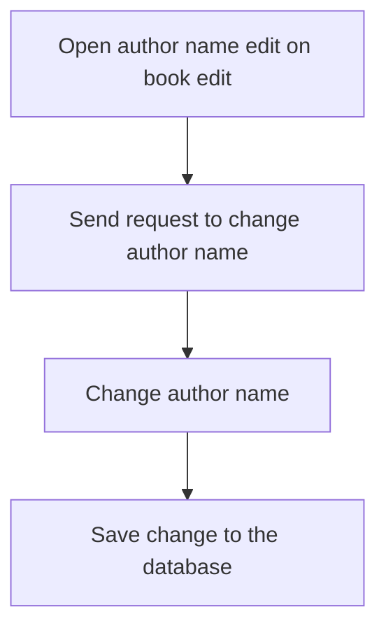

# Flow chart (create book, then edit it by adding new author, then rename author)
## Creating a Book

## Adding a New Author to the Book

## Editing Author's Name

# A prototype for editing a book/authors, on which the implemented solution is based

