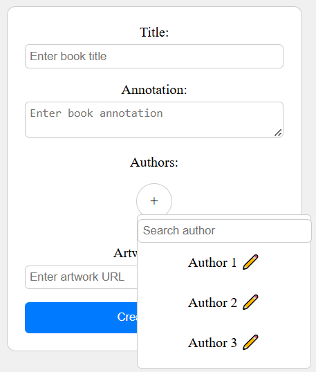
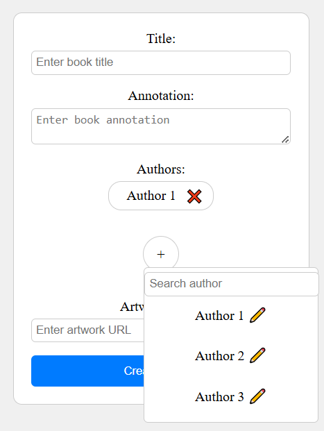
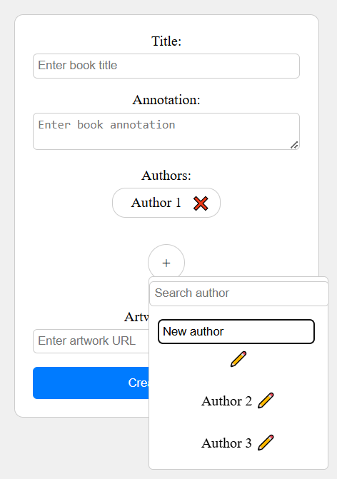
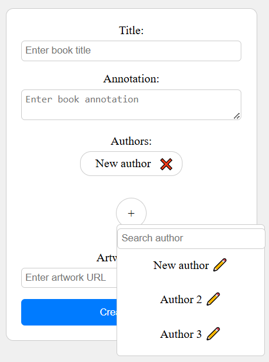

# Books and authors creating and editing

## How should we edit authors and books?
1. Use transaction - while editing book, rename author and save this change after clicking on “Save changes” button;
2. Without transaction - while editing a book, if we changed author’s name - send request to API and don’t wait to finish editing book information;
3. Remove the “Authors” table and save book authors in a “Book” table.

## Problems
1. If we use a transaction, it is unclear how to distinguish between existing authors and those added to the book, which will appear only after saving information about the book;
   - use two lists - old authors and new authors (?);
     ```json
        {
            "authors": {
                "newAuthors": [
                    {
                        "fullName": "Borisov Boris"
                    }
                ],
                "oldAuthors": [
                    {
                        "id": 5,
                        "newFullName": "Ivan Ivanov",
                        "isDeleted": false
                    },
                    {
                        "id": 6,
                        "newFullName": null,
                        "isDeleted": true
                    }
                ]
            }
        }
     ```
   - send a new authors list and find an author by its id, then compare new and old name; if the author is new - we can send null id and add author to the table “Author”.
    ```json
        "authors": [
            {
                "id": 1,
                "fullName": "Ivanov Ivan"
            },
            {
                "id": 2,
                "fullName": "Petrov Petr" // if we want to delete, just not include in the list
            },
            { // new author
                "id": null,
                "fullName": "Borisov Boris"
            }
        ]
    ```
    ```json
        "authors": [
            {
                "id": 1,
                "fullName": "Ivanov Ivan"
            },
            {
                "id": 2,
                "fullName": "Petrov Petr",
                "isDeleted": true
            },
            { // new author
                "id": null, 
                "fullName": "Borisov Boris"
            }
        ]
    ```

2. If we do not use a transaction and send a separate request, the solution is not obvious, we do not expect the author's name to change if we cancel editing the book;

## Solution
We decided to save the old version of the CRUD operations and database scheme in a separated branch and create a simplified realization of this logic by removing the “Authors” table and inline the authors to the “Books” table.

But we are not operating with an array of strings with names, but an array of objects with a fullName field, but without an id. We also remove the controller to control the authors. It remains only to decide how to store it in the database itself.

## Prototype for the current solution (with the "Authors" table)



