# QR Printing In MacOS

Drivers - https://kaywa.me/ipx1s

Currently, the installer package for MacOS can be found here:
*/TSC/MAC Driver/tsc-11.29-install*

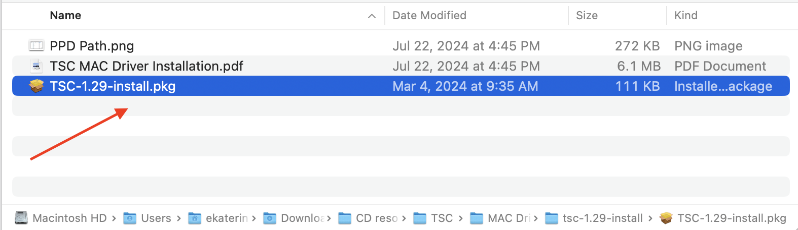

Follow the installation steps in the wizard. 

>The printer only works via a wire.

>If you face a security warning of the OS, go to *Settings -> Privacy & Security* and grant the necessary permission.

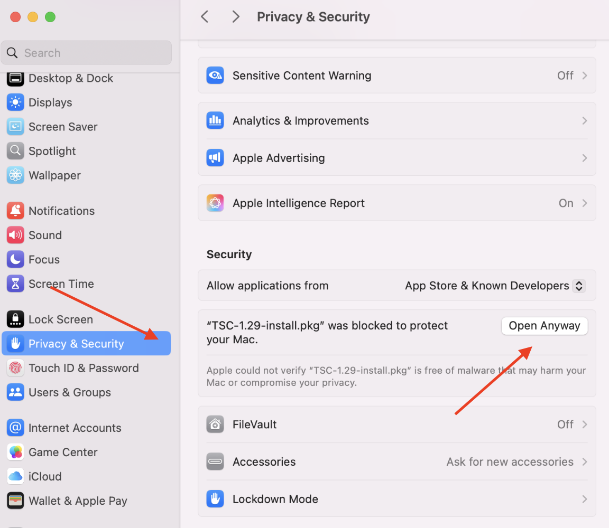

## Add Printer

1. In the System Preferences click the *Printers & Scanners*. Click *Add Printer, Scanner,...* to set up a printer.

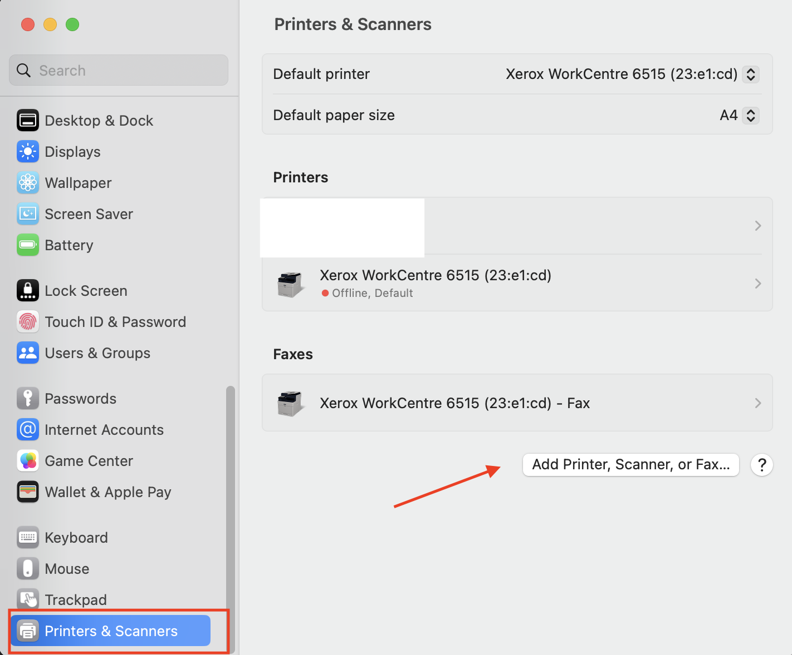

2. Connect printer to computer through USB. Select the printer model name. Select the *Other*... in the *Use* dropdown menu.

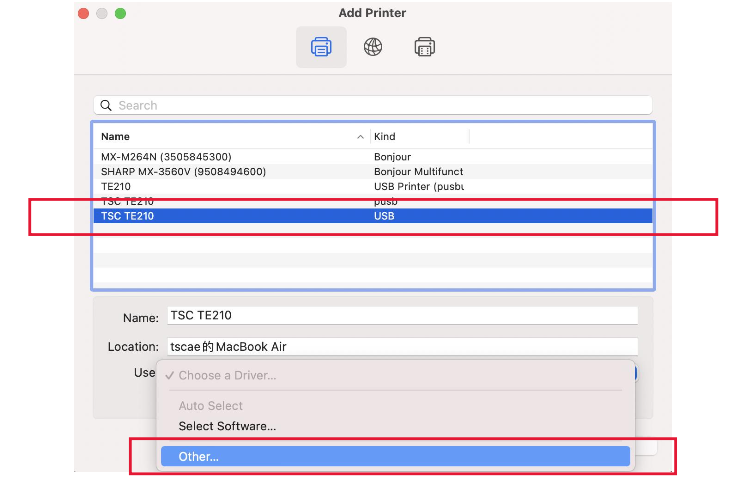

3. Select the printer PPD file, and click *Open* button.

**PPD folder path : /Library/Printers/TSC/PPDs

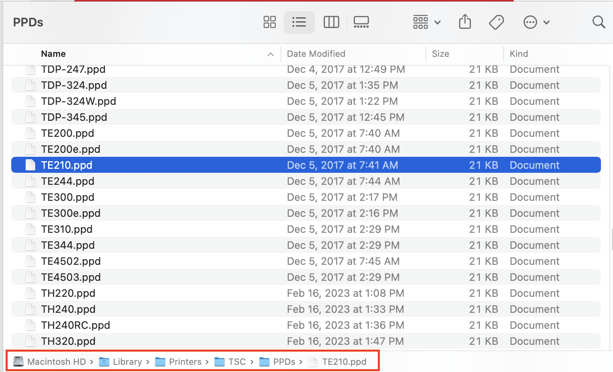

4. Click *Add* button to install the driver.

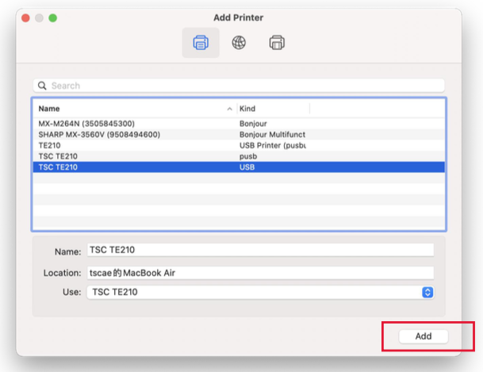

5. Done.

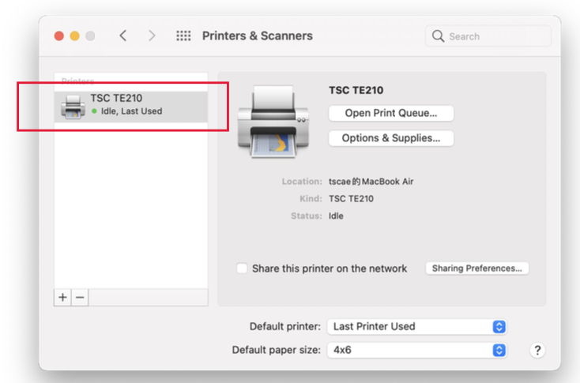

## Setting up Printing Options
1. In the browser, press *Cmd + P* or choose *File -> Print* in the browser top bar.

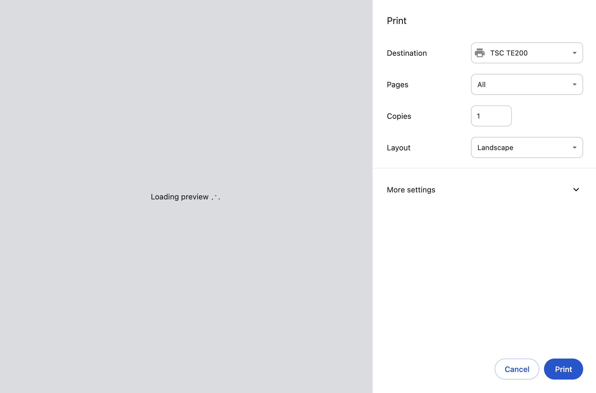

2. Select the TSC TE200 printer, then click *More settings* and *Print using system dialog*.

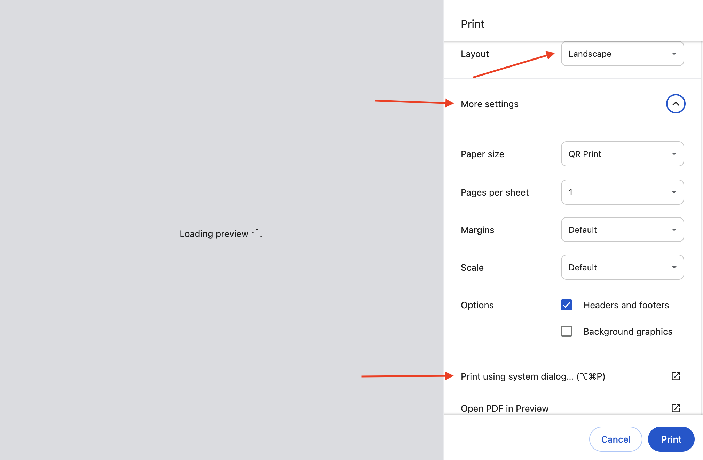

3. Make sure the TSC TE200 printer is selected, then click the *Paper Size* dropdown.

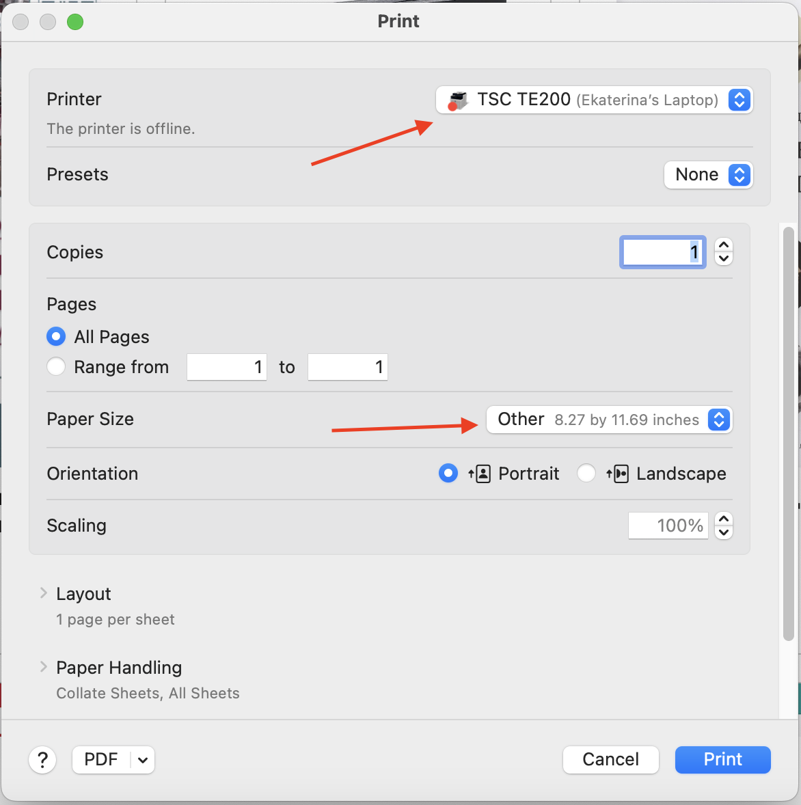

In the dropdown choose *Manage Custom Sizes*.

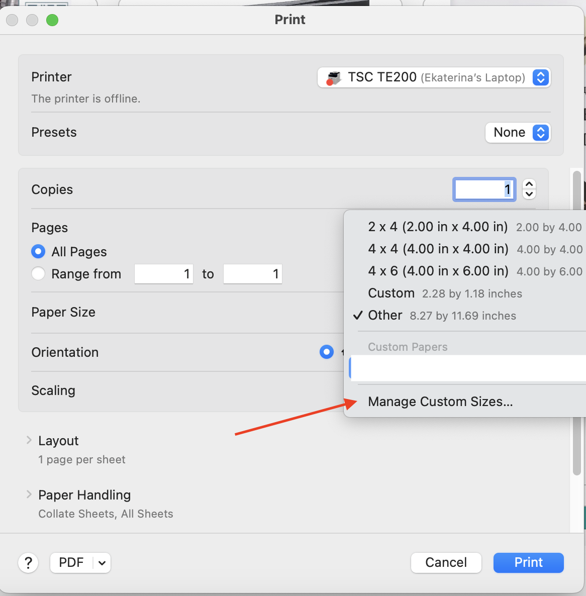

4. In the window that opens, add a configuration, fill in the configuration name, set the width to 58mm (2.28 inches) and height to 30mm (1.18 inches), and then click OK.

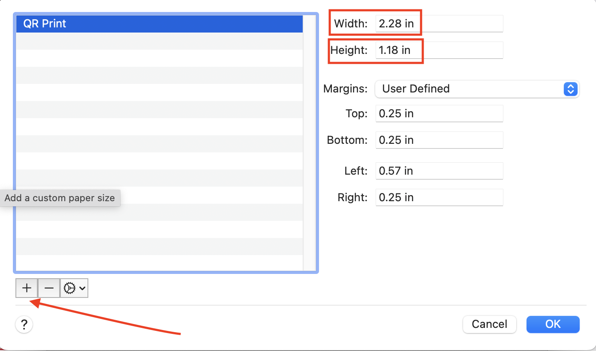

## Printing QR Codes

1. After configuring the printing settings, you can start printing. To do this, go to the page of the book for which you need to print the QR code.

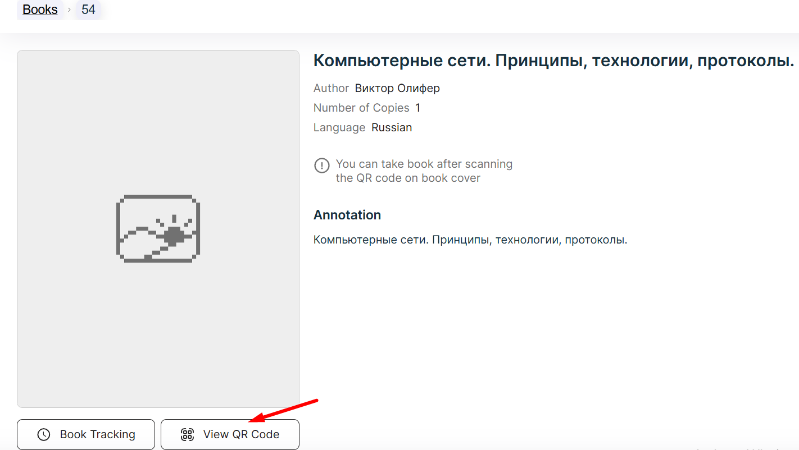

2. Click on the *Print* button.

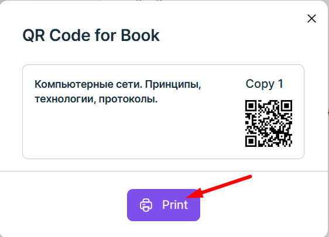

3. In the print window, select the TSC TE200 printer, select *Landscape* in the Layout field, go to *More Settings -> Print using system dialog* .

4. Select the TSC TE200 printer and use the configuration you created. Click the *Print* button, after that, the printing process should start.

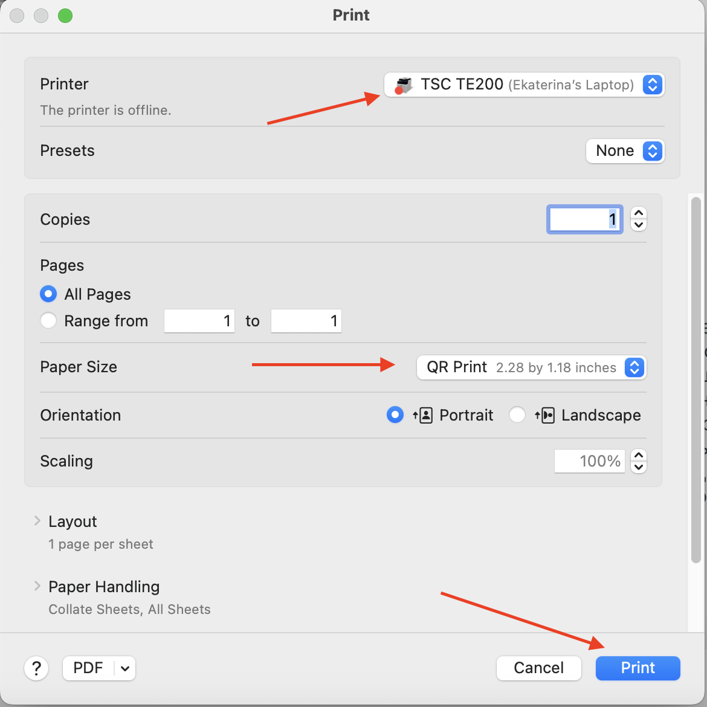
