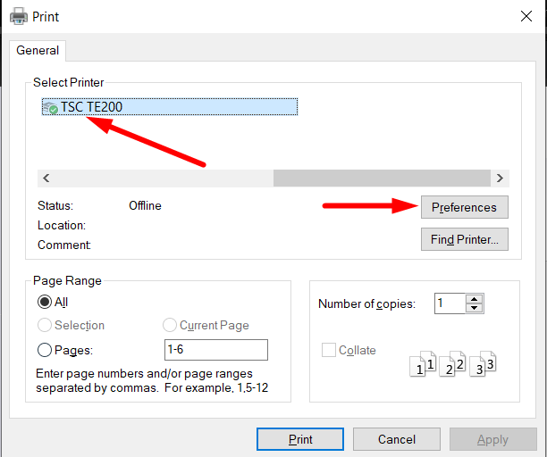
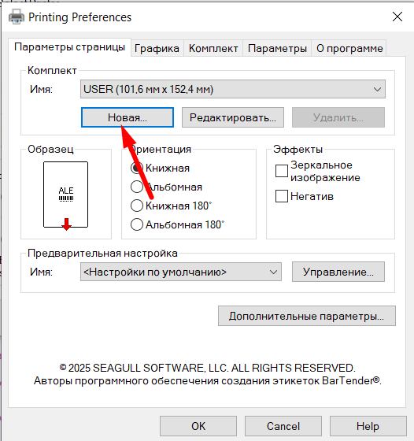
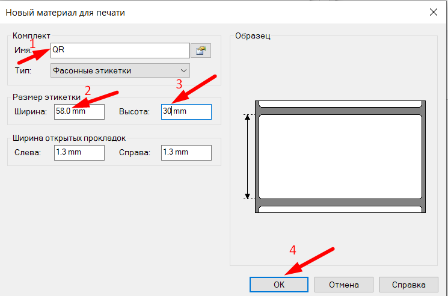
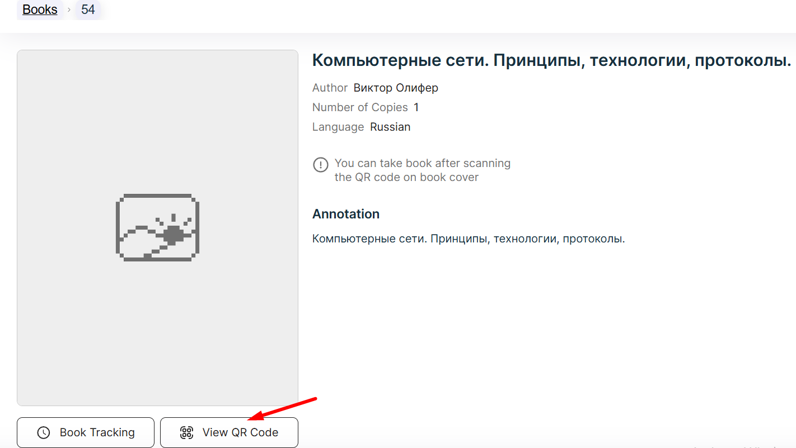
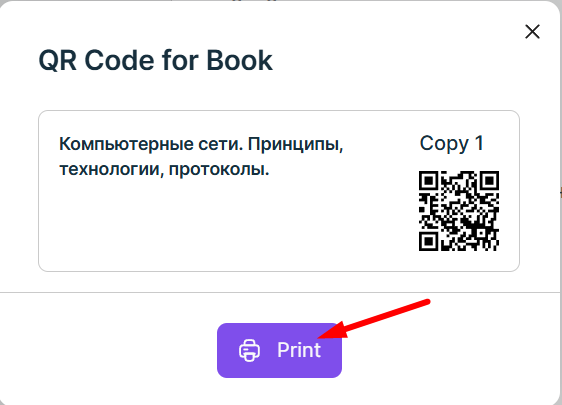
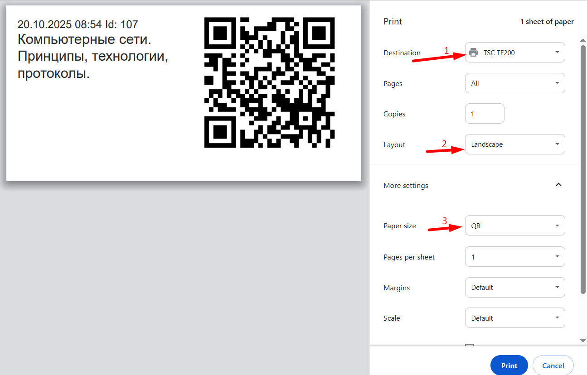
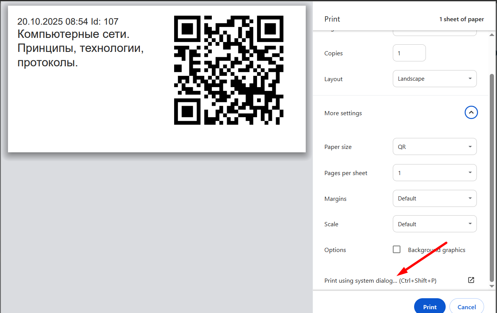
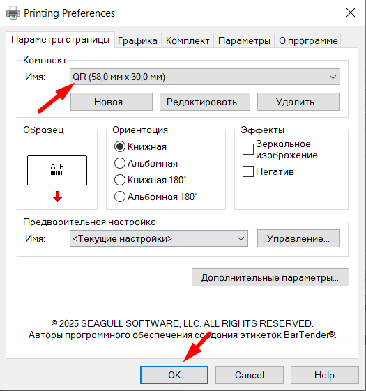
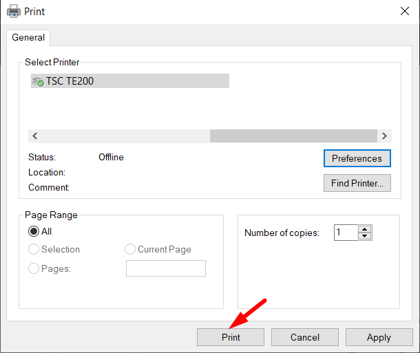

# QR Printing In Windows OS

## Setting up Printing options
1. In the browser, press Ctrl + Shift + P.

2. You should see this through the window.

You must select the TSC TE200 printer, then click the *Preferences* button.

3. Click the button to create a new configuration.

4. In the window that opens, fill in the configuration name, set the width to 58mm and height to 30mm, and then click ok.

## Printing QR codes

1. After configuring the printing settings, you can start printing. To do this, go to the page of the book for which you need to print the QR code.

2. Click on the *Print* button.

3. In the print window, select the TSC TE200 printer, select *Landscape* in the Layout field, and select the configuration you created.

4. Click *Print using system dialog*.

5. You must select the TSC TE200 printer, then click the *Preferences* button.

6. Select the created configuration and click ok.

7. Click the *print* button, after that, the printing process should start.

