# QR Printing In Windows OS

- [Installing the driver](#installing-the-driver)
- [Windows 10](#windows-10)
  - [Setting up Printing options](#setting-up-printing-options)
  - [Printing QR codes](#printing-qr-codes)
- [Windows 11](#windows-11)
  - [Setting up Printing options](#setting-up-printing-options-1)
  - [Printing QR codes](#printing-qr-codes-1)

## Installing the driver

> IMPORTANT: Driver is not compatible with Windows running on ARM processors.

> IMPORTANT: Before installing the driver, connect the printer via a wire to your computer and turn on the printer (the power button is located on the back cover of the printer). The printer only works via a wire.

1. Download [Windows driver](./drivers/Windows%20Driver/TSC_11.11.1.zip)

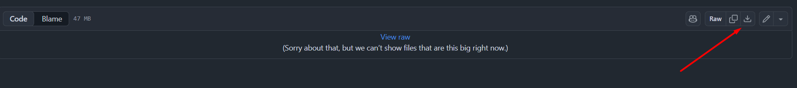

> IMPORTANT: After clicking on the download button, the driver may not start downloading immediately, you need to wait.

2. Install driver

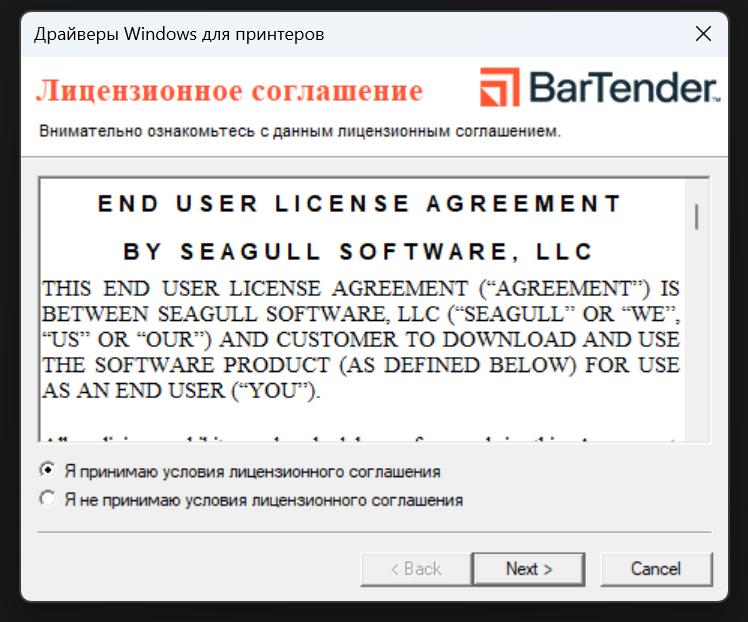

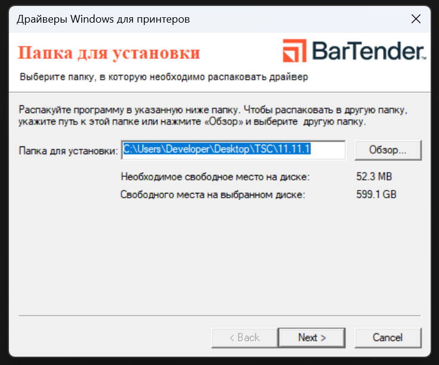

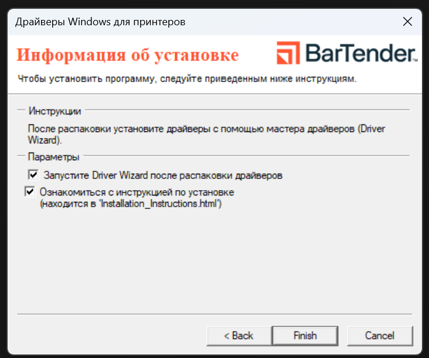

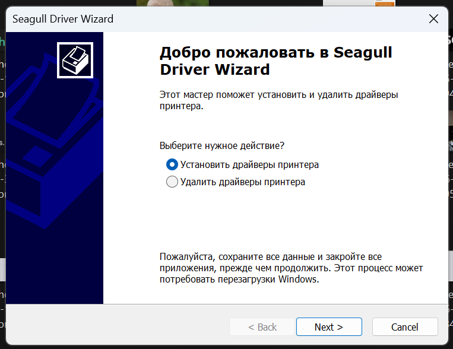

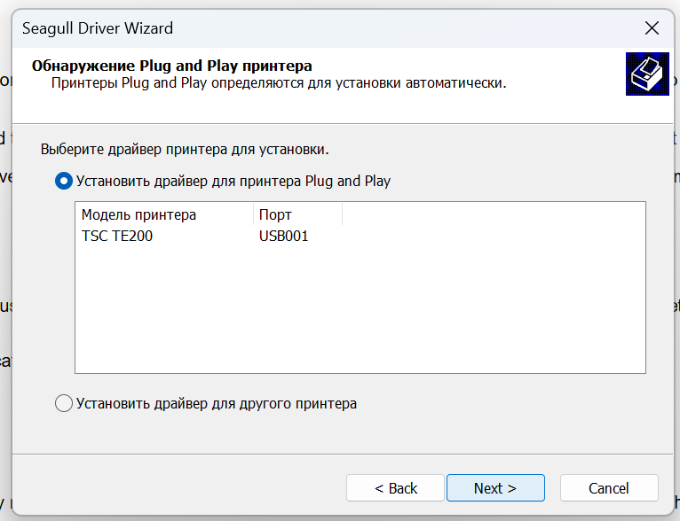

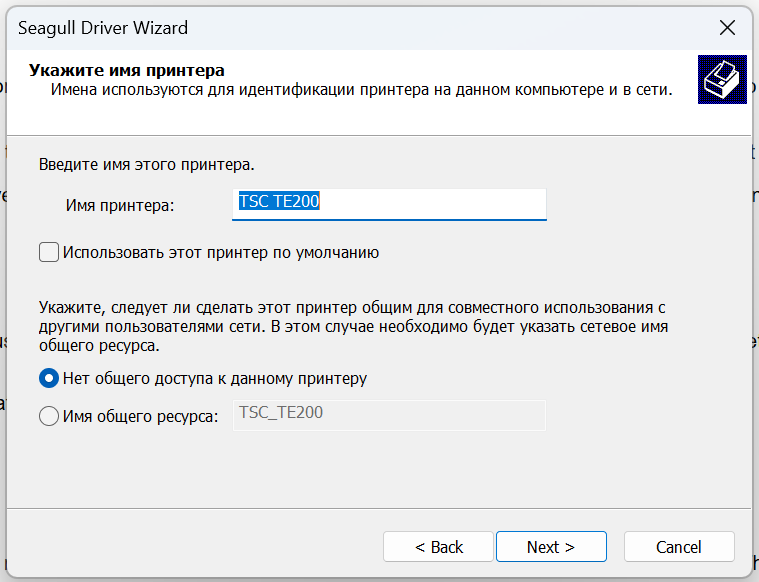

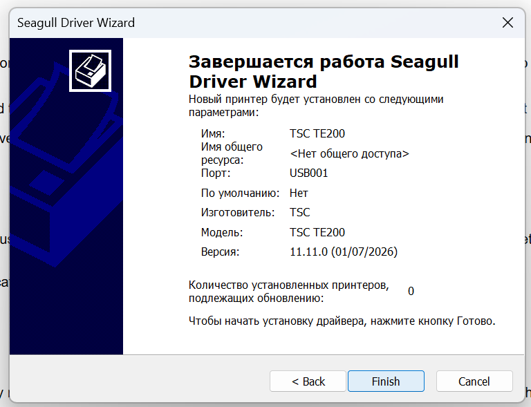

## Windows 10 

## Setting up Printing options
1. In the browser, press Ctrl + Shift + P.

2. You should see this through the window.

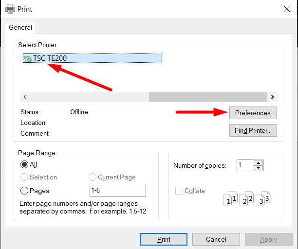

You must select the TSC TE200 printer, then click the *Preferences* button.

3. Click the button to create a new configuration.

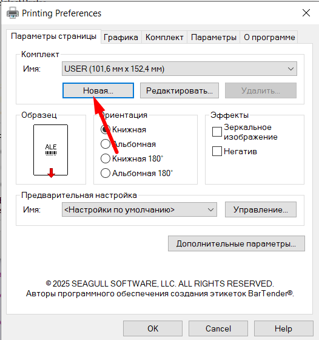

4. In the window that opens, fill in the configuration name, set the width to 58mm and height to 30mm, and then click ok.

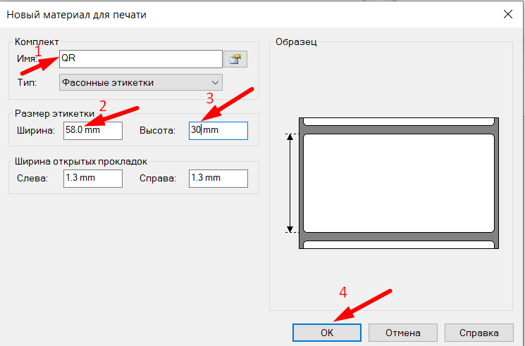

## Printing QR codes

1. After configuring the printing settings, you can start printing. To do this, go to the page of the book for which you need to print the QR code.

2. Click on the *Print* button.

3. In the print window, select the TSC TE200 printer, select *Landscape* in the Layout field, and select the configuration you created.

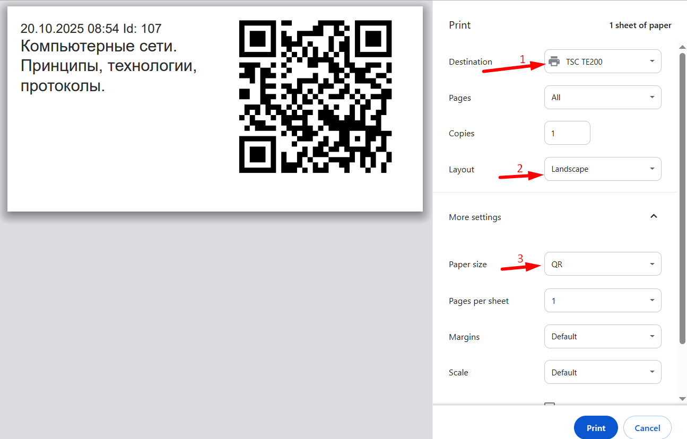

4. Click *Print using system dialog*.

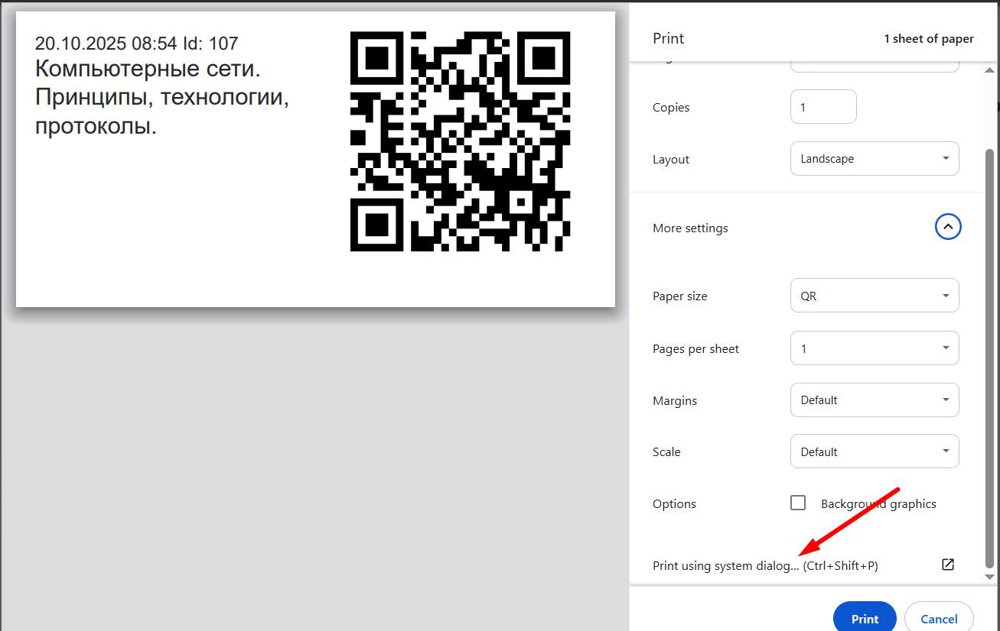

5. You must select the TSC TE200 printer, then click the *Preferences* button.

6. Select the created configuration and click ok.

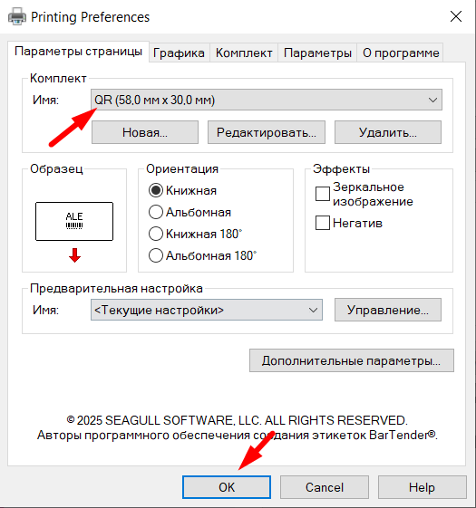

7. Click the *print* button, after that, the printing process should start.

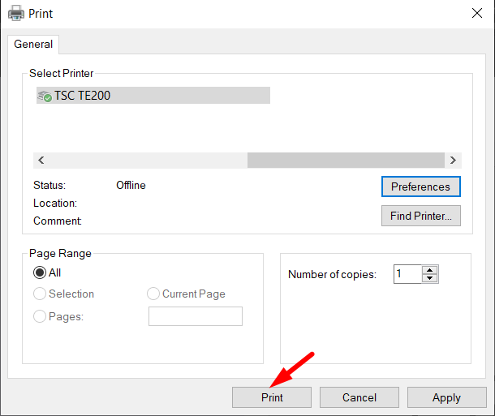

## Windows 11 

## Setting up Printing options
1. In the browser, press Ctrl + Shift + P.

2. You should see this through the window.

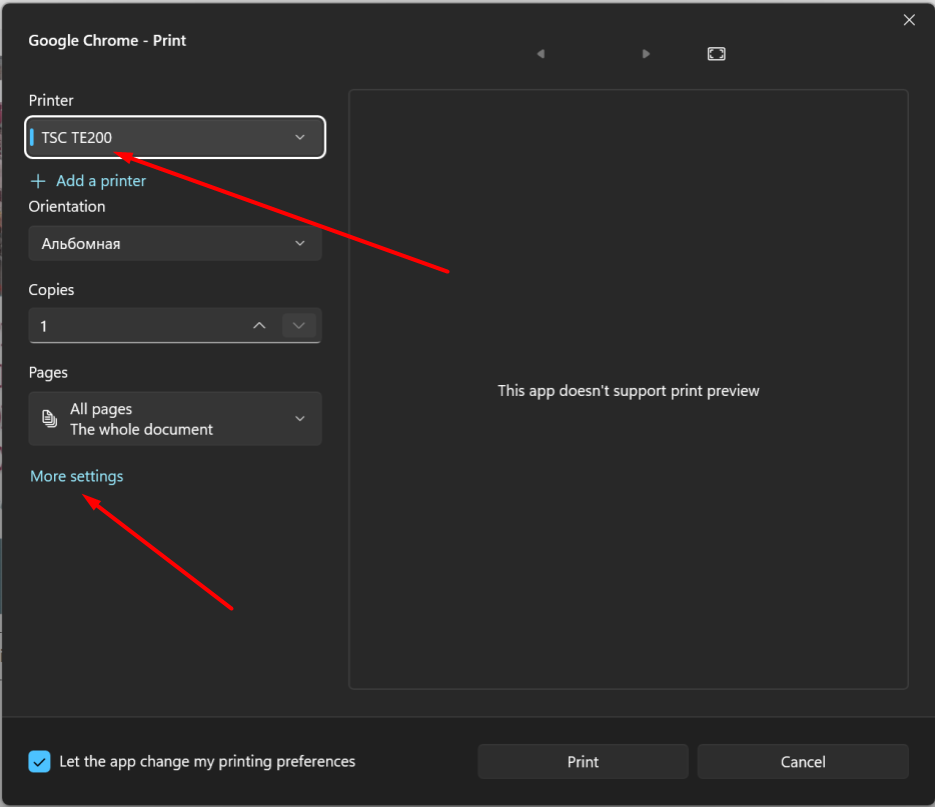

You must select the TSC TE200 printer, then click the *More settings* button.

3. Click the button to create a new configuration.

4. In the window that opens, fill in the configuration name, set the width to 58mm and height to 30mm, and then click ok.

## Printing QR codes

1. After configuring the printing settings, you can start printing. To do this, go to the page of the book for which you need to print the QR code.

2. Click on the *Print* button.

3. In the print window, select the TSC TE200 printer, select *Landscape* in the Layout field, and select the configuration you created, and сlick on the *Print* button.

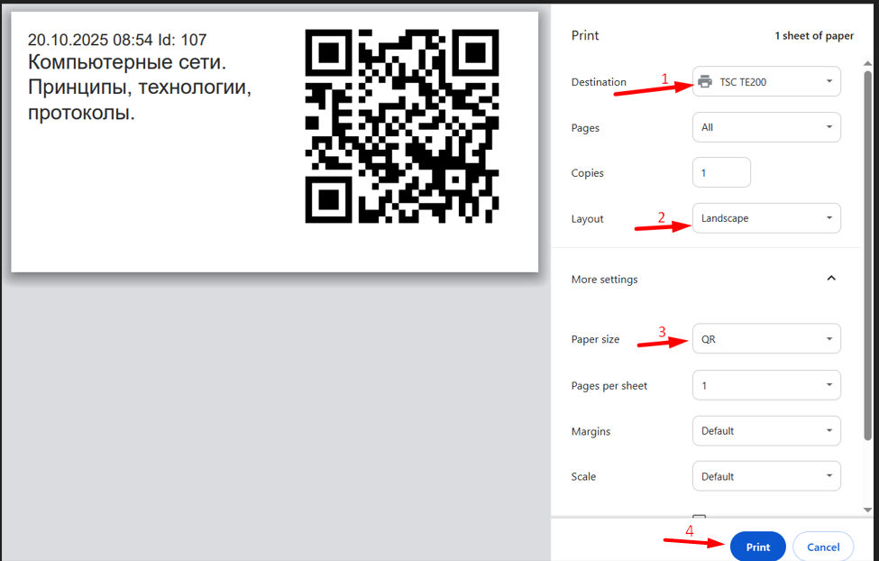
