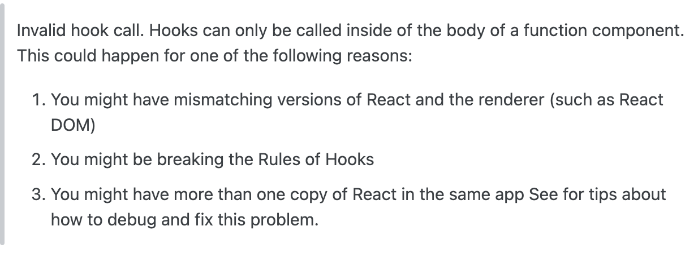
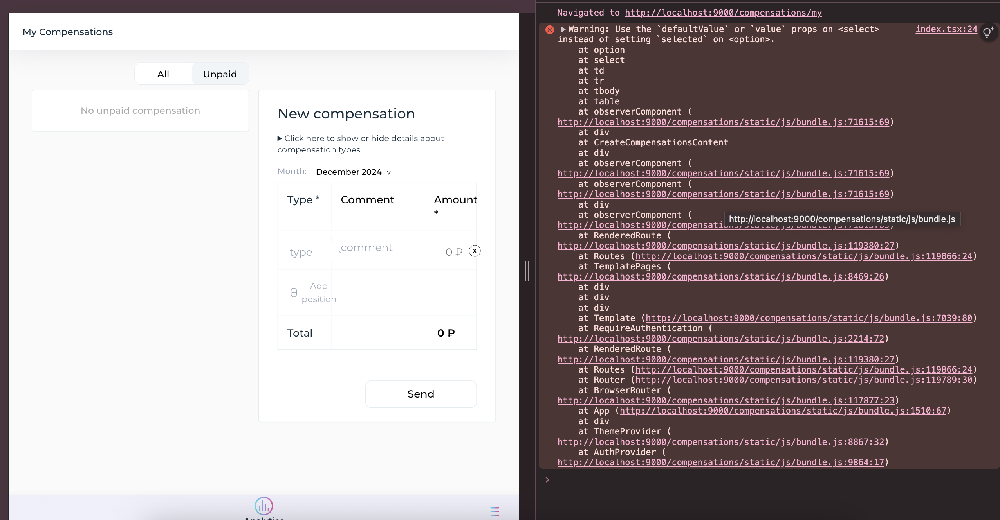

Получилось найти [одно решение](https://github.com/facebook/react/issues/13991#issuecomment-1867954003) где предлагалось в node\_modules прилинкованного пакета удалить React и линкануть его из node\_modules сервиса, в который подключили пакет (5 шаг в Solution).  
Данное решение помогло решить проблему с этой странной ошибкой про хуки,  

которая не решалась очень долго.  
в данном [обсуждении](https://stackoverflow.com/questions/56663785/invalid-hook-call-hooks-can-only-be-called-inside-of-the-body-of-a-function-com)  мы впервые прочитали о связи этой ошибки с npm link и дублированием реакта

Чтобы все заработало как надо в нашем случае, нужно провести несколько этапов танцев с бубнами:  
terminal in react-tc-auth folder

1. npm i  
2. удалить папки node\_modules и es  
3. nvm use 12 (без этого шаг 4 будет падать с проблемой выполнения npx simple-git-hooks)  
4. npm ci

terminal in React-Packages folder

5. npm ci (для установки общих пакетов для выполнения билда пакетов)

terminal in react-tc-auth folder

6. npm run build   
7. nvm use 20.18 (повышаем ноду, чтобы link хранился в папке той же ноды, какая используется в проекте, куда подключаем пакет)  
8. npm link   

В сервисе, куда подключаем пакет:

1. npm link @tourmalinecore/react-tc-auth  
2. находим в node\_modules подключенный пакет и открываем node\_modules пакета, открываем терминал этой папки  
3. rm \-rf react  
4. rm \-rf react-dom  
5. rm \-rf react-router-dom                                                
6. ln \-s *your\_full\_path*/inner-circle-compensations-ui/node\_modules/react  
7. ln \-s *your\_full\_path*/inner-circle-compensations-ui/node\_modules/react-dom  
8. ln \-s *your\_full\_path*/inner-circle-compensations-ui/node\_modules/react-router-dom  
   

После этого ошибка о хуках больше не отображается и мы видим сервис с подключенным пакетом через npm link в рабочем состоянии
