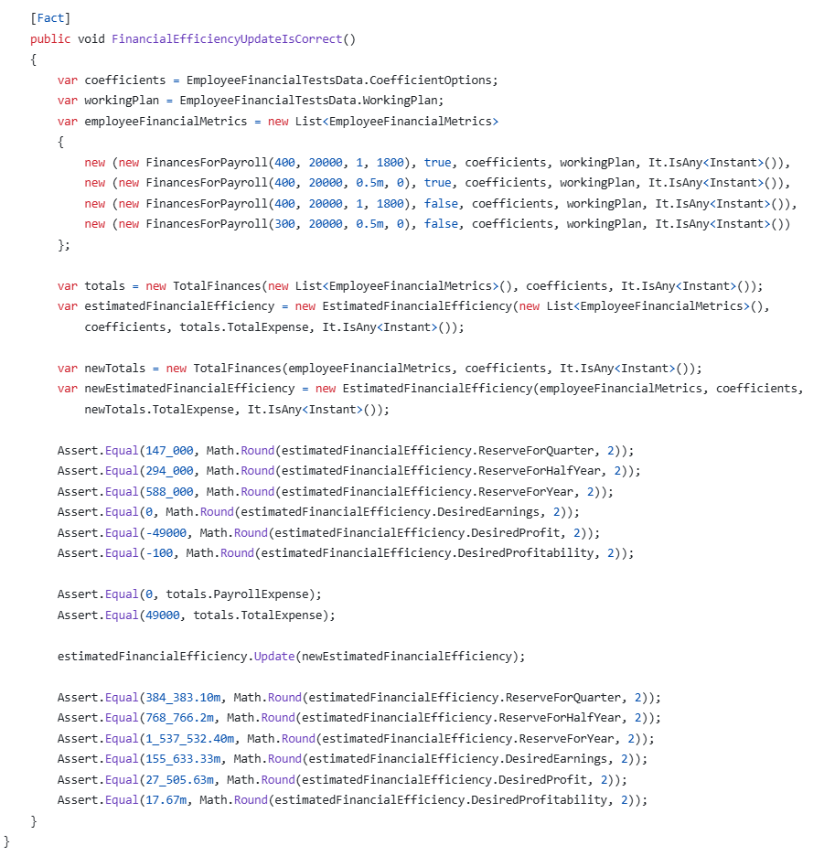

# Compensations-ui
###  E2E: 
		1. compensations-smoke.cy.ts
			- ПЕРЕД каждым тестом подчистка компенсаций (хард-delete)
			- ПЕРЕД каждым тестом аутентификация 
			- ПОСЛЕ каждого теста подчистка компенсаций (хард-delete) 
			- Визит страницы компенсаций
			- Добавление новой компенсации
			- Просмотр в графе unpaid новой компенсации
			- Проставление Mark as paid
			- Просмотр в графе All (что уже оплачена) и что Unpaid пустой
		В целом пока согласен
### Components 
		Will be analyzed later.
			
# Compensations-api
### Unit tests:
- **Tests/Api/CompensationControllerTests.cs**
	- GetAdminAllCompensationsAsync_ShouldReturnCorrectTotal - возврат всех компенсаций прилетевших админу 
	- GetAllCompensationsAsync_ShouldReturnCorrectTotal - возврат всех компенсаций пользователя
- **Tests/Application/Commands/CompensationCreationCommandTests.cs**:
	- CreateAsync_ShouldCreateCompensation()
	- CreateWithZeroQuantityAsync_ShouldThrowException()
- **Tests/Application/Commands/CompensationHardDeletionCommandTests.cs**:
	- DeleteAsync_ShouldDeleteCompensationFromDbSet()
- **Tests/Application/Queries/PersonalCompensationsQueryTests.cs**:
	- UnknownEmployeeIdAndTenantId_ShouldFindNoData()
	- SingleRecordAvailable_ShouldFindItByEmployeeIdAndTenantId()
		- CompensationsWithDifferentTenantsForTheSameEmployee_ShouldFindCompensationsOnlyForTheNeededTenant()

### Karate tests: 
		1. E2E Flow:
			- # Authentication
			- # Get all personal compensations - No compensations
			- # Get types
			- # Create a wrong compensation to be deleted later
			- # Delete the wrong compensation
			- # Get all personal compensations - Unpaid compensation exists
			- # Create compensation
			- # Get all personal compensations - Unpaid compensation exists
			- # Update compensation status
			- # Get all personal compensations - Paid compensation exists

# Documents-ui
### E2E Tests:
		No tests
Хотелось бы видеть полноценный E2E-флоу по отправке документов, но пока сам не особо знаком с данным функционалом
### Component tests:
- Will be analyzed later
# Documents-api
### Unit-tests:
- **Tests/Api/DocumentsControllerTests.cs**
	- SendMailingPayslips_ShouldRequireAuthorizeAttribute()
	- SendMailingPayslips_WhenEmailSenderServiceIsNotAvailable_ShouldThrowException()
	- SendMailingPayslips_WhenEmployeesServiceIsNotAvailable_ShouldThrowException()
	- SendMailingPayslips_WhenServicesAreAvailable_NoException()
	- SendMailingPayslips_PayslipsValidatorShouldBeCalledOnce()
- **Tests/Application/PayslipsValidatorTests.cs**
	- PayslipsListMustNotBeEmpty()
	- PayslipFilesMustNotBeEmpty()
	- PayslipFileNameMustNotBeNull()
	- LastNameMustBeIncludedInPayslipFileName()
	- EmployesWithLastNamesShouldBeExist()
	- NoException()
### Karate Tests
	No tests

# Books-ui
### E2E: 
		1.  books-smoke.cy.ts
			- Визит страницы книг
			- Убедиться, что есть Init надпись приветствия на странице "This is init books page"
			- Можно также проверить корректность url страницы

Ну, на первоначальном этапе - сойдет.

# Books-api
### Karate tests: 
		1. E2E Flow:
			- # Authentication
			- # Step 1: Create a new book
			- # Step 2: Check that the book is created
			- # Step 3: Edit the book's details
			- # Step 4: Get the edited book by ID and verify the details have changed
			- # Step 5: Delete the book (soft delete)
			- # Step 6: Verify the book is no longer in the list
			- # Step 7: Delete the book (hard delete)

# Auth-ui 
### E2E: 
	No tests
		1. Идеи по сценариям:
			1. Ввести правильный логин и неправильный пароль - получить вывод сообщения на экран об ошибке валидации кредов (можно проверить и другие сценарии: valid password + invalid login, invalid login + invalid password)
			2. Ввести правильные поля - убедиться, что не выводится на экран сообщение об ошибке валидации кредов
			3. Forgot password -> should.have.text('Reset Password')
			4.  From being on a page /auth/reset -> Click "backwards" arrow -> we're on a page /auth
			5.  Maybe check logic of resetting password as a full E2E test
		
### Components: 
	No tests

# Auth-api
### Unit tests:
1.
![[Pasted image 20250505131248.png]]
- **Tests/Integration/RegistrationAndLoginTests.cs** = не хватает тестов  Ввести правильный логин и неправильный пароль - получить вывод сообщения на экран об ошибке валидации кредов (можно проверить и другие сценарии: valid password + invalid login, invalid login + invalid password)

- проверить на уровне - ввели креды - получили токен
- креды неверны (все комбинации) - токен не получили, получили эксепшн


2.
![[Pasted image 20250505131739.png]]
- **Tests/Integration/LogoutTests.cs** = Можно добавить эти строчки:
```
Assert.False(string.IsNullOrWhiteSpace(authModelWithNewTokens.AccessToken.Value));
Assert.False(string.IsNullOrWhiteSpace(authModelWithNewTokens.RefreshToken.Value));
```

# Employees-api
### Karate tests: 
		1. E2E Negative Flow (Access denied):
			- # enter invalid login
			- # enter invalid password
			- # enter invalid creds
		2. E2E Happy Path:
		    - # authentication
		    - # create compensation
		    - # get all personal compensations
		    - # get types
		    - # get all admin compensations 
		    - # update compensation status

### Unit Tests:
1.
- **Tests/Data/EmployeeFinancialTestsData.cs** 


- EmployeeFinancialMetrics() - (data for tests)

2.
- **Tests/EmployeeFinancialMetricsTest.cs**


3.
- **Tests/EmployeeFinancialServiceTests.cs**
- 
// new metrics are correct for existing employee
// metrics diff are correct for existing employee
// new metrics are correct for an employee copy
// new total metrics are correct
// new total metrics diff is correct

- **Tests/EmployeeFinancialServiceTests.cs**
- 
- 
// check that new metrics are correct for unofficial employee
// check that metrics diff are correct for unofficial employee
// check that new total metrics are correct
// check that new total metrics diff is correct

4.
- **Tests/EmployeePersonalInformationUpdateCommandTests.cs**
- 

5.
- **Tests/EmployeePersonnelNumberTests.cs**
- 
- 

6.
- **Tests/EmployeeUpdateParametersValidatorTests.cs**
- 

7.
- **Tests/EmployeesComparerTests.cs**
- 
- 

8.
- **Tests/EstimatedFinancialEfficiencyTests.cs**
- 
- 

9.
- **Tests/TotalFinancesTests.cs**
- 

# Inner-Circle-ui

### Components:
- 
### E2E:
	No tests - what about my legendary mailslurp E2E test...???
# Accounts-ui 
### E2E:
	Authentication only (doesn't work)

# Components 
	Will be analyzed later.

# Accounts-api 
### Karate: 
	# Authentication
	# create tenant
	# create role
	# create account
	# verify the account has created roleId and tenantId
	# delete account
	# delete role
	# delete tenant

