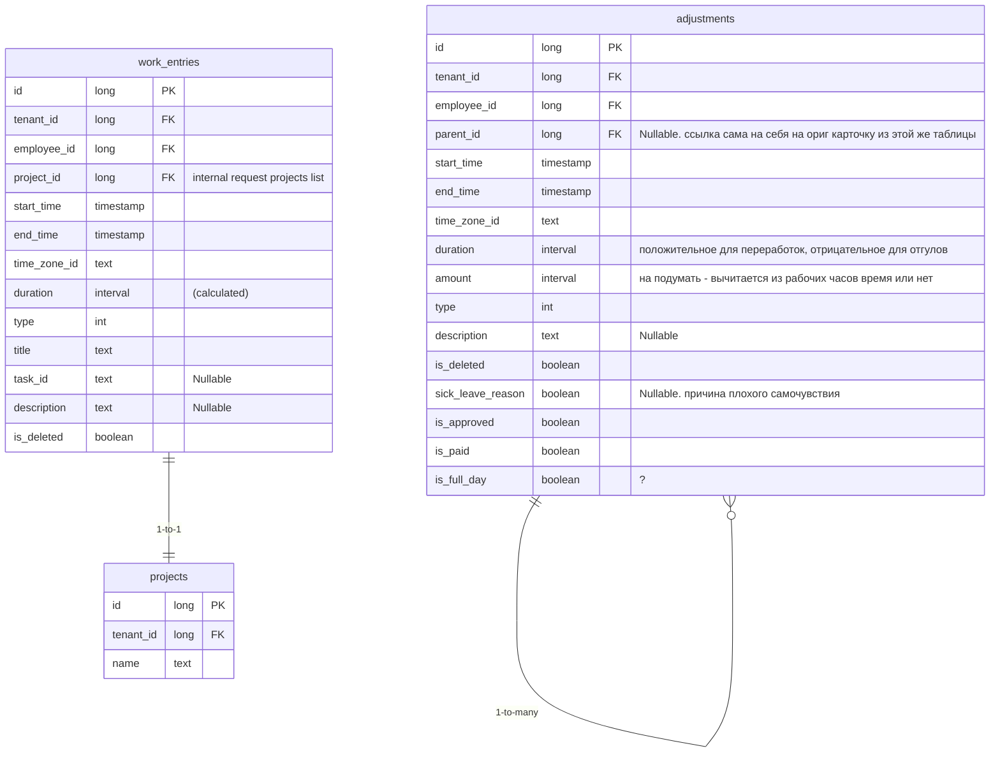

# Time Tracker Backend Strategy 2025-11-20, 2025-11-25

## Entities

### 1. work_entries

- задача

#### sql notes

```sql
SELECT *
FROM work_entries
WHERE startTime > @startTime
AND endTime < @endTime
AND tenantId = @tenantId
AND employeeId = @employeeId

CREATE INDEX a ON work_entries
```

### 2. adjustments

**другие события**

- отсутствие (отраб)
- отсутствие (не отраб)
- опоздание
- плохое самочувствие
- отработка
- переработка
- отгул
- обед

**события на день**

- дей-офф (отраб)
- дей-офф (не отраб)
- больничный
- отпуск

## endpoints

#### work-entries

- **POST** /api/time/tracking/work-entries - add
- **POST** /api/time/tracking/work-entries/{id} - update
- **GET** /api/time/tracking/work-entries?startTime={startTime}&endTime={endTime} - get list by period
- **DELETE** /api/time/tracking/work-entries/{id} - soft delete

#### adjustments

- **POST** /api/time/tracking/adjustments - add
- **POST** /api/time/tracking/adjustments/{id} - update
- **GET** /api/time/tracking/adjustments?startTime={startTime}&endTime={endTime} - get list by period
- **DELETE** /api/time/tracking/adjustments/{id} - soft delete


## db diagram


