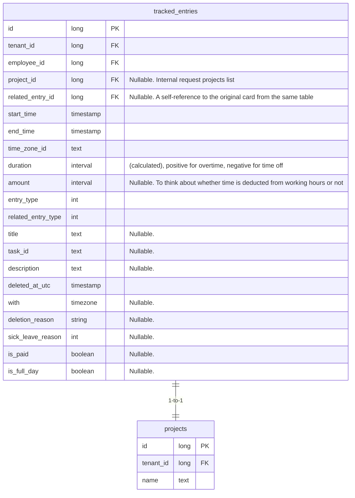

# Time Tracker Backend Contract

## Entities

### 1. tracked_entries

Events:
- Task
- Away (with make-up time)
- Away (with make-up time)
- Late
- Unwell
- Make-up time
- Make-up time for day-off
- Overtime
- Time-off

All-day events:
- Lunch
- Sick leave
- Vacation
- Day-off to make up for
- Personal day-off
- Unpaid day-off

#### sql notes

```sql
SELECT *
FROM tracked_entries
WHERE startTime > @startTime
AND endTime < @endTime
AND tenantId = @tenantId
AND employeeId = @employeeId

CREATE INDEX a ON tracked_entries
```

## Endpoints
- [Tracking Endpoints](#tracking-endpoints)
  - [Entries](#entries)
  - [Task Entries](#task-entries)
  - [Unwell Entries](#unwell-entries)
  - [Away With Make-Up Time](#away-with-make-up-time)
- [Reporting Endpoints](#reporting-endpoints)
- [Internal Endpoints](#internal-endpoints)

---

## Tracking Endpoints 
We made a decision to split endpoints by entry type to have strict, predictable contract. With separate endpoints for each entry type, every field in the contract can be required and non-nullable because there's no need to accommodate multiple schemas in one payload.

### entries

1. **GET** `/api/tracking/entries?startDate={startDate}&endDate={endDate}` - return entries by period

**Response body:**
```c#
{
  taskEntries: [
    {
      id: long,
      title: string,
      taskId: string,
      projectId: long,
      description: string,
      startTime: DateTime,
      endTime: DateTime,
      entryType: int,
    },
  ]
  unwellEntries: [
    {
      id: long,
      startTime: DateTime,
      endTime: DateTime,
      entryType: int,
    },
  ],
  awayWithMakeUpTimeEntries: [
    {
      id: long,
      description: string,
      startTime: DateTime,
      endTime: DateTime,
      makeUpTimeList: [
        {
          startTime: DateTime,
          endTime: DateTime,
        }
      ]
    }
  ],
  makeUpTimeEntries: [
    relatedEntryId: long,
    entryType: int,
    relatedEntryType: int,
    startTime: DateTime,
    endTime: DateTime
  ]
}
```

2.  **DELETE** `/api/tracking/entries/{entryId}/soft-delete` - soft delete 

**Request body:**
```c#
{
  deletionReason: string,
}
``` 

### task-entries

1. **POST** `/api/tracking/task-entries` - add Task entry

**Request body:**
```c#
{
  title: string,
  taskId: string,
  projectId: long,
  description: string,
  startTime: DateTime,
  endTime: DateTime,
  timeZoneId: string
}
```

**Response body:**
```c#
{
  newTaskEntryId: long
}
```

2. **POST** `/api/tracking/task-entries/{id}` - update Task entry

**Request body:**
```c#
{
  title: string,
  taskId: string,
  projectId: long,
  description: string,
  startTime: DateTime,
  endTime: DateTime,
  timeZoneId: string
}
```

**Response body:** 200 OK


3. **GET** `/api/tracking/task-entries/{id}` - get Task entry

**Response body:**
```c#
{
  id: long,
  title: string,
  taskId: string,
  projectId: long,
  description: string,
  startTime: DateTime,
  endTime: DateTime,
  entryType: int,
}
```

4. **GET** `/api/tracking/task-entries/projects?date={date}` - return employee's projects

**Response body:**

```c#
{
  projects: [
    {
      id: long,
      name: string;
    },
  ]
}
```

#### unwell-entries

1. **POST** `/api/tracking/unwell-entries` - add Unwell entries

**Request body:**
```c#
{
  startTime: DateTime,
  endTime: DateTime,
  timeZoneId: string
}
```

**Response body:**
```c#
{
  newUnwellEntryId: long
}
```

2. **POST** `/api/tracking/unwell-entries/{id}` - update Unwell entry

**Request body:**
```c#
{
  startTime: DateTime,
  endTime: DateTime,
  timeZoneId: string
}
```

3. **GET** `/api/tracking/unwell-entries/{id}` - get Unwell entry

**Response body:**
```c#
{
  id: long,
  startTime: DateTime,
  endTime: DateTime,
  entryType: int
}
```

#### away-with-make-up-time

1. **POST** `/api/tracking/away-with-make-up-time-entries` - add Away With Make-Up Time entry

**Request body:**
```c#
{
  // we discarded the idea to call this field "awayReason" in favor of consistency across all entry types
  description: string,
  startTime: DateTime,
  endTime: DateTime,
  makeUpTimeList: [
    {
      startTime: DateTime,
      endTime: DateTime,
    }
  ]
}
```

**Response body:**
```c#
{
  newAwayWithMakeUpTimeEntryId: long
}
```

2. **POST** `/api/tracking/away-with-make-up-time-entries/{id}` - update Away With Make-Up Time entry

**Request body:**
```c#
{
  // we discarded the idea to call this field "awayReason" in favor of consistency across all entry types
  description: string,
  startTime: DateTime,
  endTime: DateTime,
  makeUpTimeList: [
    {
      startTime: DateTime,
      endTime: DateTime,
    }
  ]
}
```

3. **GET** `/api/tracking/away-with-make-up-time-entries/{id}` - get Away With Make-Up Time entry

**Response body:**
```c#
{
  id: long,
  startTime: DateTime,
  endTime: DateTime,
  entryType: int,
  description: string,
  makeUpTimeList: [
    {
      id: long,
      startTime: DateTime,
      endTime: DateTime
    }
  ]
}
```

## Reporting Endpoints 

1. **GET** `/api/reporting/personal-report?employeeId={employeeId}&year={year}&month={month}` - return personal report 

**Response body:**
```c#
{
  trackedEntries: [
    {
      id: long,
      trackedHoursPerDay: decimal,
      startTime: DateTime,
      endTime: DateTime,
      hours: decimal,
      entryType: int,
      project?: {
        id: long,
        name: string,
      },
      task?: {
        id: string,
        title: string,
      },
      description?: string
    }
  ],
  taskHours: decimal,
  unwellHours: decimal
}
```

2. **GET** `/api/reporting/employees` - return employees

**Response body:**
```c#
{
  employees: [
    {
      id: long,
      fullName: string,
    }
  ]
}
```

## Internal endpoints

1. **GET** `/api/projects/tracked-task-hours?projectId={projectId}&startDate={startDate}&endDate={endDate}` - return employees tracked task hours


**Response body:**
```c#
{
  employeesTrackedTaskHours: [
    {
      employeeId: long,
      trackedHours: decimal,
    }
  ]
}
```

2. **GET** `/api/projects` - Get all projects

**Response body:**
```c#
{
  projects: [
    {
      id: long,
      name: string,
    }
  ]
}
``

## db diagram


```mermaid
erDiagram
    tracked_entries ||--|| projects : "1-to-1"
    tracked_entries {
      id long PK
      tenant_id long FK
      employee_id long FK
      project_id long FK "Nullable. Internal request projects list"
      related_entry_id long FK "Nullable. A self-reference to the original card from the same table"
      start_time timestamp
      end_time timestamp
      time_zone_id text
      duration interval "(calculated), positive for overtime, negative for time off"
      amount interval "Nullable. To think about whether time is deducted from working hours or not"
      entry_type int
      related_entry_type int
      title text "Nullable."
      task_id text "Nullable."
      description text "Nullable."
      deleted_at_utc timestamp with timezone "Nullable."
      deletion_reason string "Nullable."
      sick_leave_reason int "Nullable."
      is_paid boolean "Nullable."
      is_full_day boolean "Nullable."
    }
    projects {
      id long PK
      tenant_id long FK
      name text
    }
```
