# Time Tracker Backend Contract

## Entities

### 1. work_entries

Events:
- Task
- Away (unpaid)
- Away (paid)
- Late
- Unwell
- Make-up time
- Make-up time for day-off
- Overtime
- Time-off

All-day events:
- Lunch
- Sick leave
- Vacation
- Day-off to make up for
- Personal day-off
- Unpaid day-off

#### sql notes

```sql
SELECT *
FROM work_entries
WHERE startTime > @startTime
AND endTime < @endTime
AND tenantId = @tenantId
AND employeeId = @employeeId

CREATE INDEX a ON work_entries
```

## Endpoints

#### work-entries

1. **GET** /api/time/tracking/work-entries?startDate={startDate}&endDate={endDate} - get list by period

**Response body:**
```ts
{
  workEntries: [
    {
      id: long,
      title: string,
      taskId: string,
      projectName: string,
      description: string,
      startTime: DateTime,
      endTime: DateTime,
      type: int,
    },
  ]
}
```

2. **POST** /api/time/tracking/work-entries - add

**Request body:**
```ts
{
  title: string,
  taskId: string,
  projectId: long,
  description: string,
  startTime: DateTime,
  endTime: DateTime,
  timeZoneId: string
  type: int,
}
```

**Response body:**
```ts
{
  newWorkEntryId: long
}
```

3. **POST** /api/time/tracking/work-entries/{id} - update

**Request body:**
```ts
{
  title: string,
  taskId: string,
  projectId: long,
  description: string,
  startTime: DateTime,
  endTime: DateTime,
  timeZoneId: string
}
```

**Response body:** 200 OK

4. **GET** /api/time/tracking/work-entries/projects?date={date} - get employee's projects

**Response body:**

```ts
{
  projects: [
    {
      id: long,
      name: string;
    },
  ]
}
```

5. **DELETE** /api/time/tracking/work-entries/{id}/soft-delete - soft delete  

## db for add task & get all tasks & update task (1 iteration)

```ts
{
  id long PK
  tenant_id long FK
  employee_id long FK
  project_id long FK "internal request projects list"
  start_time timestamp
  end_time timestamp
  time_zone_id text
  duration interval "(calculated)"
  type int // get default value from emun for now
  title text
  task_id text
  description text
  is_deleted boolean
}
```

## db diagram

```mermaid
erDiagram
    work_entries ||--|| projects : "1-to-1"
    work_entries {
      id long PK
      tenant_id long FK
      employee_id long FK
      project_id long FK "Nullable. Internal request projects list"
      parent_id long FK "Nullable. A self-reference to the original card from the same table"
      start_time timestamp
      end_time timestamp
      time_zone_id text
      duration interval "(calculated), positive for overtime, negative for time off"
      amount interval "Nullable. To think about whether time is deducted from working hours or not"
      type int
      title text "Nullable."
      task_id text "Nullable."
      description text "Nullable."
      is_deleted boolean
      sick_leave_reason int "Nullable."
      is_paid boolean "Nullable."
      is_full_day boolean "Nullable."
    }
    projects {
      id long PK
      tenant_id long FK
      name text
    }
```


