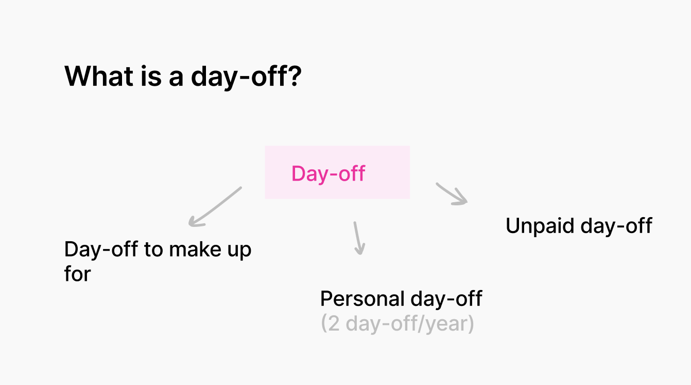
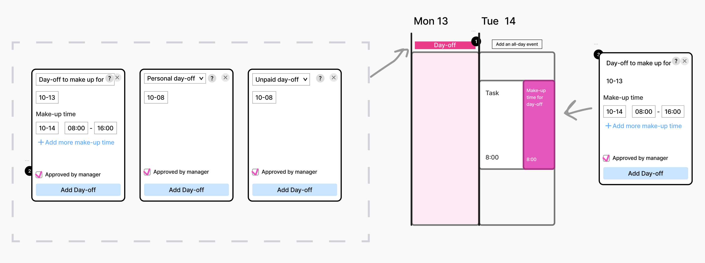
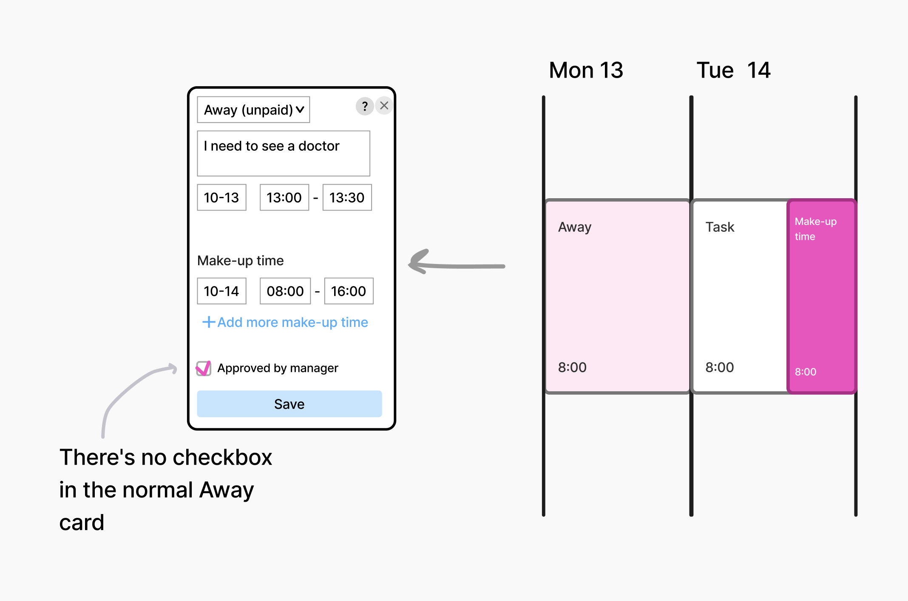
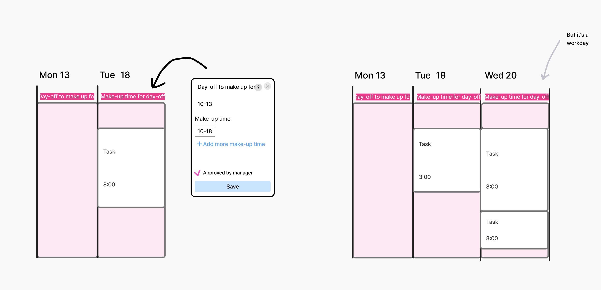

# Day-off

## Status
Accepted (2025-12-10)

## Context

Expectations on user stories: 
1. I mark a day-off.
2. I mark the make-up time.
3. My colleagues know I'm not available.
4. The timesheet is accurate.
5. The manager issues an accurate invoice to the customer.

In order to accomplish items 3-5, we need to collect information about the employees who take days-off and when they make up for that time, i.e., to accomplish items 1 and 2. This is the focus of the 1st iteration.

## Decision

A Day-off is an all-day event, so the employee selects it from the day's header. 
1. In the drop-down list we can select a Day-off to make up for or a Personal day-off or an Unpaid day-off depending on the situation (see Event types). If we have a Day-off to make up for, we must fill in the make-up time. If we have a Personal day-off or Unpaid day-off, we only need to select the date.
2. In order to save the day-off, we must check the box next to “Approved by the manager”. This checkbox does not affect anything and is a reminder to get the manager’s approval.
3. Similarly to the usual Make-up time, clicking on the “Make-up time for Day-off” event will open the event of the Day-off to make up for with non-editable event type and day.

## Alternatives

### Mark the Day-off as a usual Away event, but for 8 hours
We didn't go for this option because an Away event doesn’t need to be approved by the manager, unlike a Day-off.

### Mark the Make-up time of the Day-off as an all-day event

This option did not work for us because: 
1. It is not clear at what time the person will be working during this Make-up time (at any time during the day).
2. It is impossible to split the Make-up time into several days.

