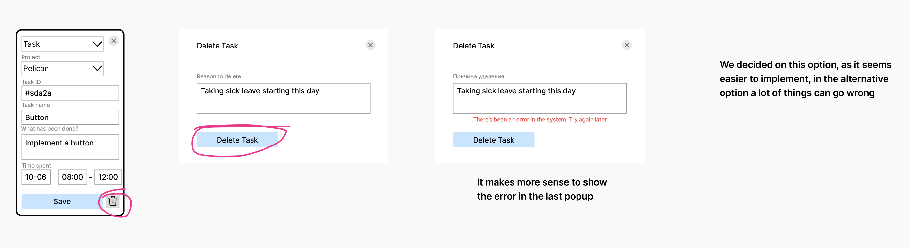
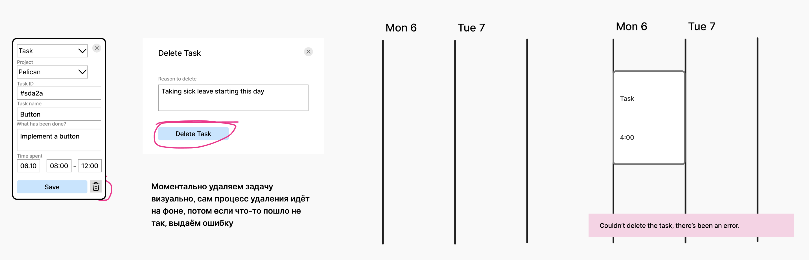

# Delete error

## Status
Accepted (2025-12-10)

## Context
A solution in case something goes wrong during delete.

## Decision

## Alternatives
Instantly perform delete on UI for the user. The delete process takes place in the background, the user does not see it. If delete fails, we will show an error.

The advantage is that the user doesn’t have to wait for the system’s response.

Potential pitfalls:
1. The manager also tracks an event - there is an error.
2. In case you need to track a pair programming session, and added only yourself, whereas your colleague added the both of you (maybe at the same time, maybe later).
3. In case of a pair programming session, both programmers add an event at the same time.
4. If the system has been processing deletе for a long time and something has been added already/user has left the tab.
