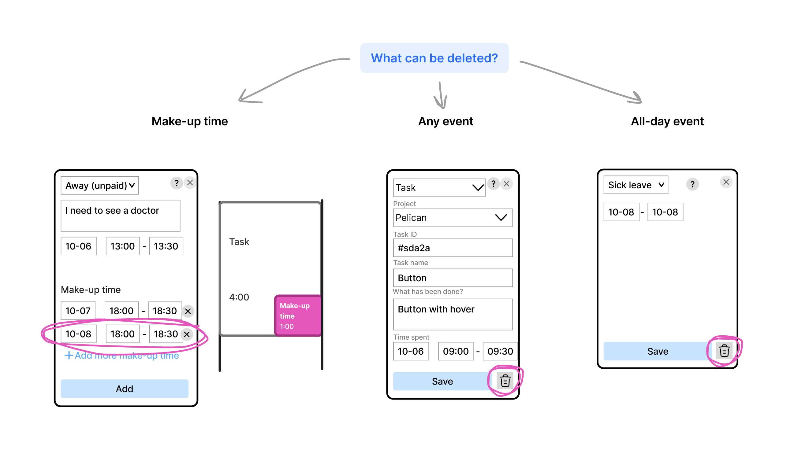
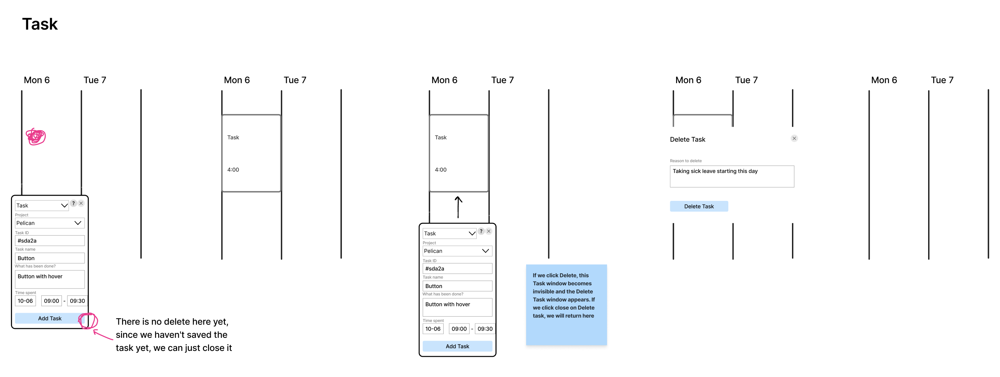
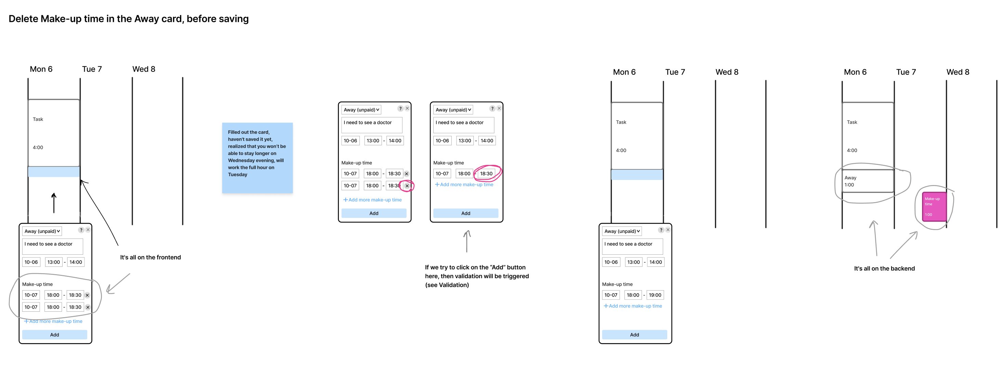
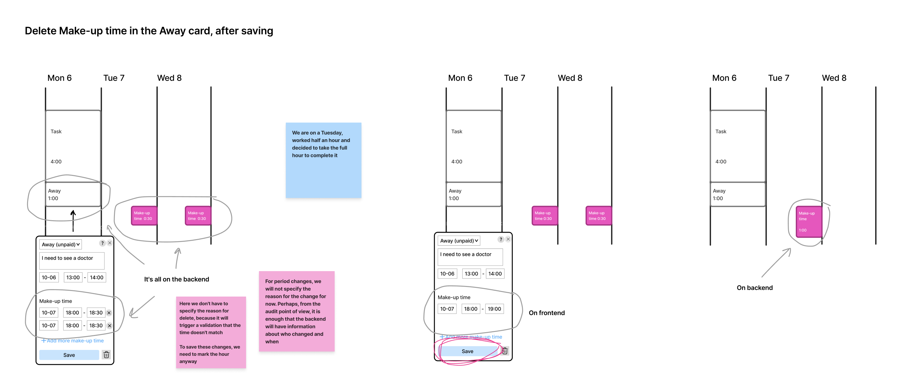
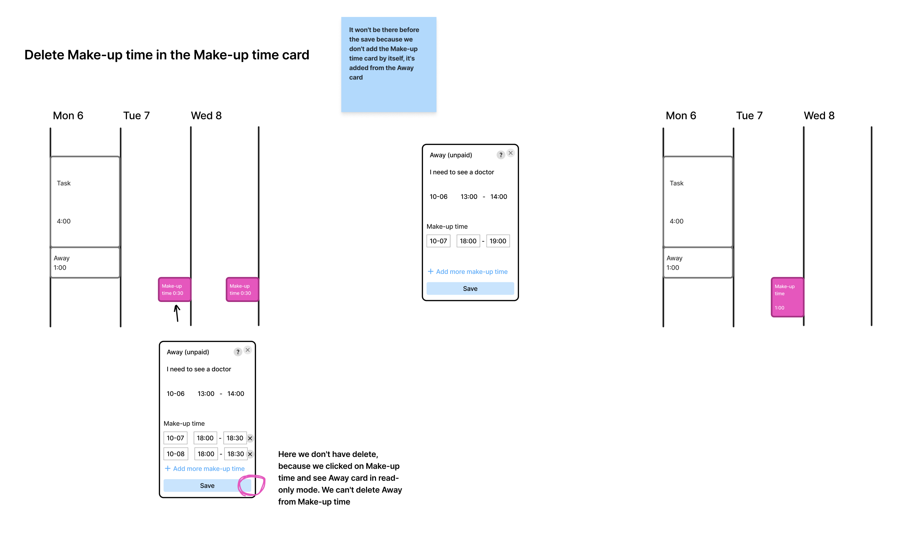
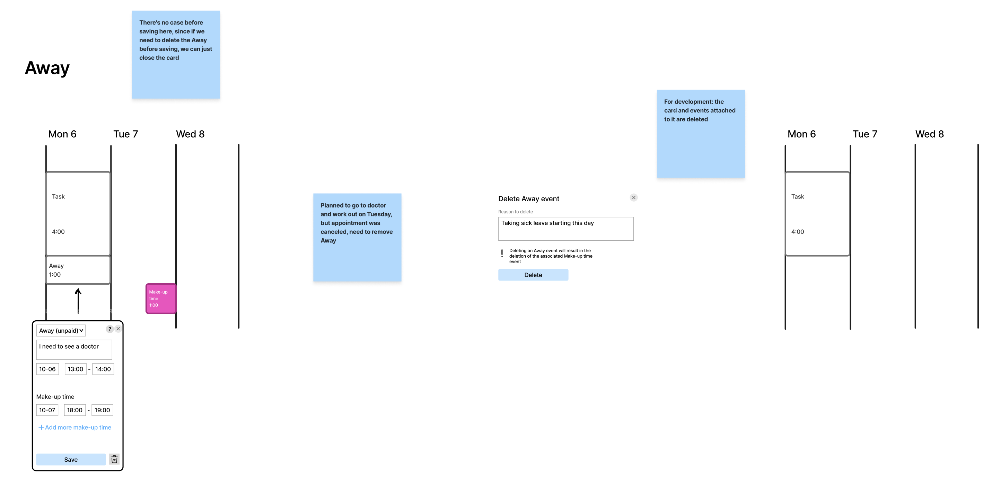
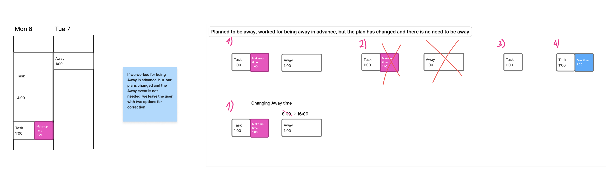
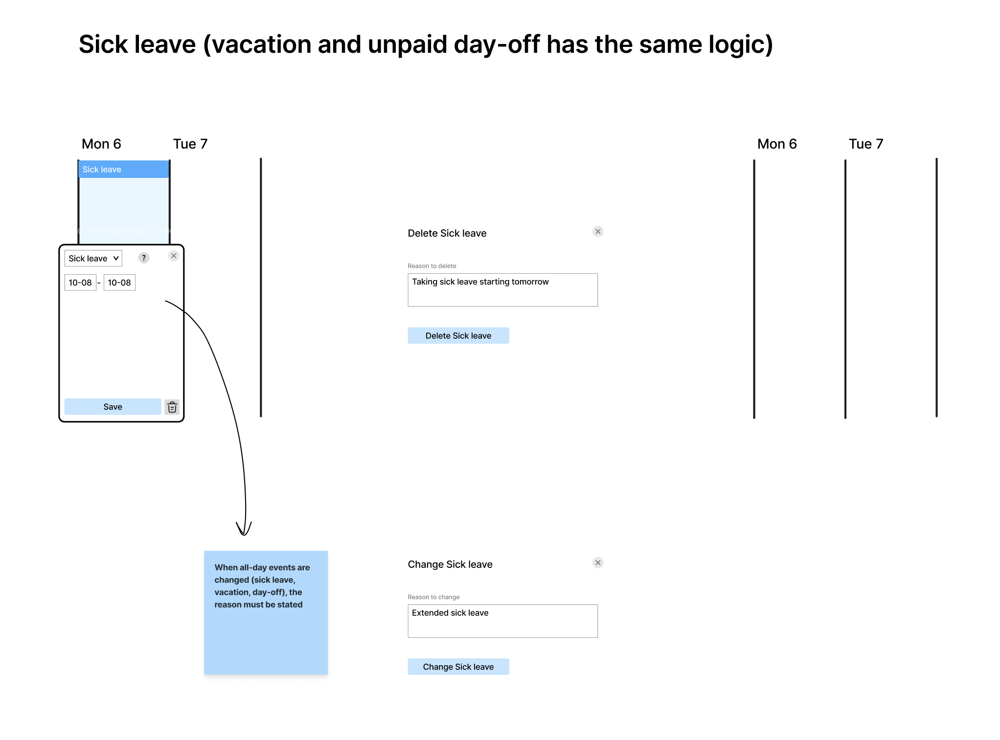
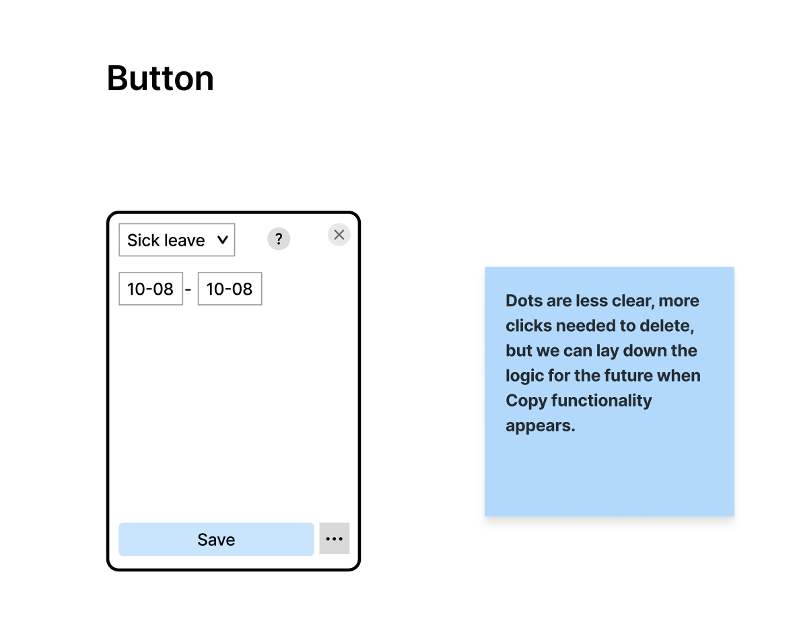
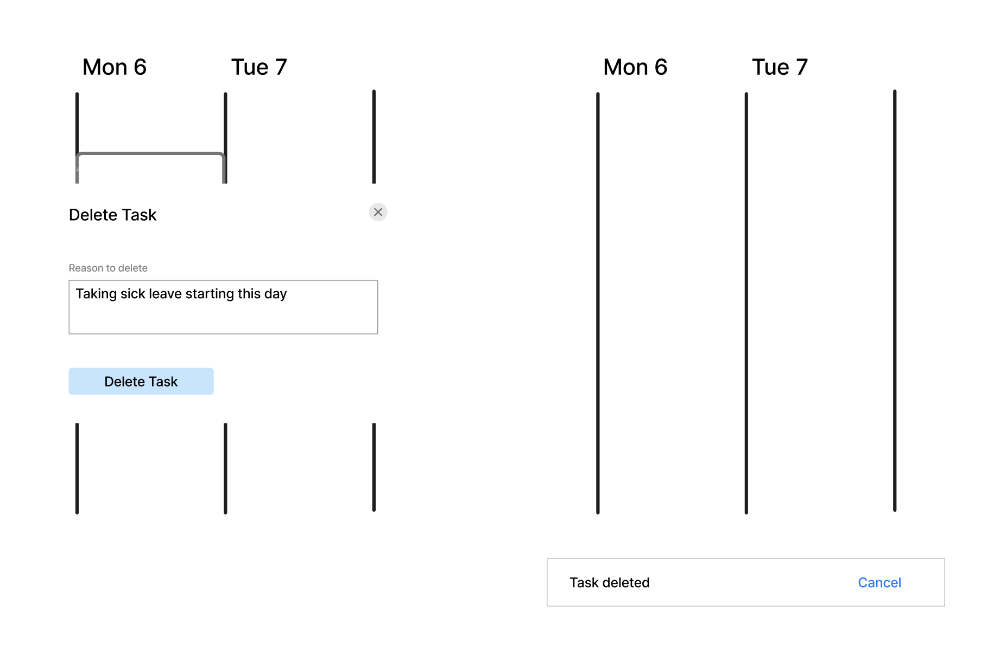

# Delete

## Status
Proposed (2025-12-04)

## Context
We need to specify a reason why an entry was deleted, in order to make it clear why the event was created and then not just edited in case of inaccuracy, but deleted. It is implied that an employee had a plan and it didn't come true, and if we don't specify the reason, it won't be clear why. In this case the manager will have trouble understanding why an employee worked when they were not supposed to, or didn't work when they were supposed to.    

## Decision

### Delete cases for all events

### Task

### Deleting Make-up time in the Away event, before saving

### Deleting Make-up time in the Away event, after saving

### Deleting Make-up time in the Make-up time event
It won't be there before saving because we don't add the Make-up time by itself, it's added from the Away event

### Away
There's no case before saving here, since if we need to delete the Away event before saving, we can just close the event.

### Sick leave (the same logic applies to vacation and day-off)

## Alternatives

### Button
Dots are less clear, more clicks needed to delete, but we can lay down the logic for the future when Copy functionality appears.

### Cancel delete
After deleting a task, a confirmation bar appears to confirm the action performed with the option to Undo delete. This is good from the UX perspective to let the user undo a deletion made by mistake, but at the moment the user is well insured against accidental deletion by the confirmation box. It's also technically difficult to reconstruct the chain of deletions. We can think this through better at a later stage, we won't do it now. 

