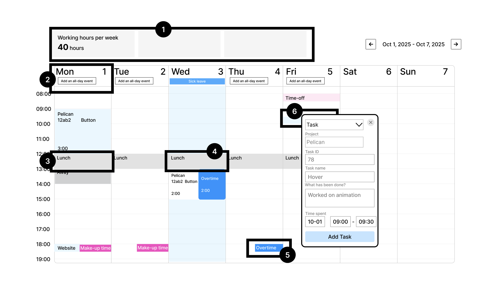
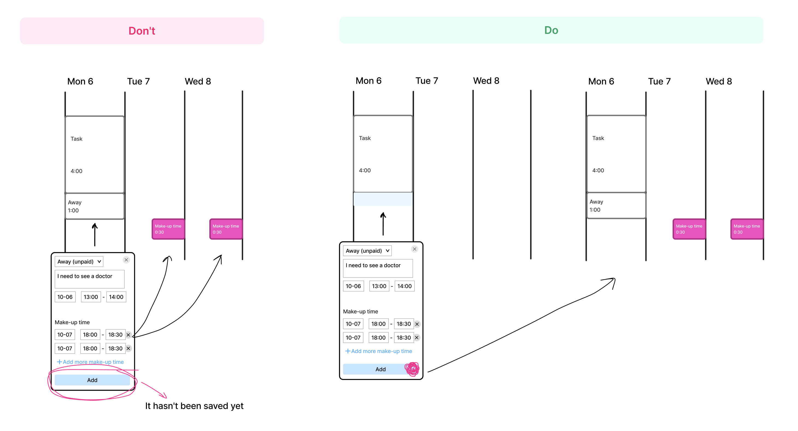

# Desktop version

## Status
Proposed (2025-12-04)

## Decision

1. Widgets are planned here. They should be taken into account when designing, but we will make them later on.
2. For now we make it a button, the main thing is to be able to set the type of day. At the design stage the button may be replaced with a more suitable component. If this functionality is done differently in a ready-made library, there’s no need to redesign it.
3. There is no lunch on non-working days (regular weekends, holidays). We’ll hardcode it at first, and in future we'll get it from the production calendar. Lunch is tied to working days (for example, there is lunch on Saturday if it is a working day).
4. We haven't decided what we're doing with lunch when we create an all-day event, we'll probably leave it for now.
5. Initial goal: to avoid overlapping of events like in a calendar. We haven’t been able to achieve it so far, as make-up time and overtime still overlap.
6. When adding an event, the default slot is set to 30 minutes. At the moment the clicked slot won’t display any immediate time changes made in the event until the event is saved.
7. Employees will have access only to their own time tracker. The manager will have access to all time trackers.

### Display while filling event

Make-up time will become visible once we have saved the event. Now we will not try to display it while filling the event. We will finalize it in the next iteration.

