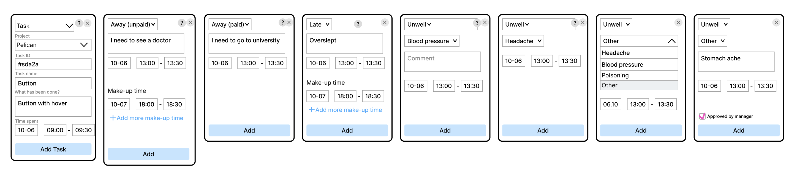
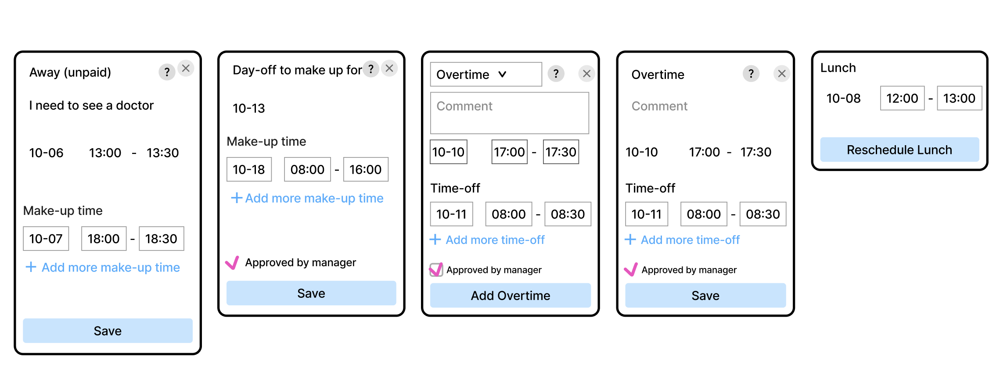
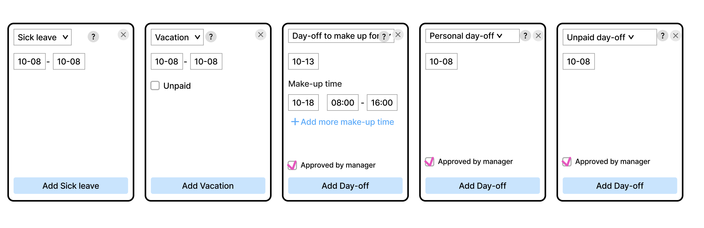

# Event types

## Status
Accepted (2025-12-10)

## Context
Different types of events are needed to cover all user stories and cases when working with the time tracker.

This document doesn’t specify event states and delete process. You can find this information in the DDR on Delete and in the prototype.

## Decision

### List of current events

Events:
1. Task
2. Away (unpaid)
3. Away (paid)
4. Late
5. Unwell
6. Make-up time
7. Make-up time for day-off
8. Overtime
9. Time-off
10. Lunch

All-day events: 
1. Sick leave
2. Vacation
3. Day-off to make up for
4. Personal day-off
5. Unpaid day-off

### Task
A task an employee performs on a workday.

Contains:
1. Event type (drop-down list).
2. Hint with the event description.
3. Project (required field). Right now it is a text field. Later we’ll add the projects module and make this field a drop-down list.
4. Task ID (optional field).
5. Task name (required field).
6. What has been done? (required field). This is a required field because it is important to keep track of the process, progress on the task and what exactly was done.
7. Time spent (required field).
8. "Add Task" button.

### Away (unpaid)
Time spent away from work for a personal reason that needs to be compensated for, timewise. Example: urgent need to leave, doctor's appointment, family reasons.

Contains:
1. Event type (drop-down list).
2. Hint with the event description.
3. Comment (required field).
4. Away time (required field).
5. Make-up time (required field).
6. "Add more make-up time" button.
7. "Add" button.

### Away (paid)
Time spent away from work for a reason agreed with the management that does not need to be compensated for. Example: corporate or study issues.

Contains:
1. Event type (drop-down list).
2. Hint with the event description.
3. Comment (required field).
4. Away time (required field).
5. "Add" button.

### Late

Contains:
1. Event type (drop-down list).
2. Hint with the event description.
3. Comment (required field).
4. Time late (required field).
5. Make-up time (required field).
6. "Add more make-up time" button.
7. "Add" button.

Late event now has the same structure as Unpaid Away, but we make it separate for the future.

In the future we will think on how to track being late very quickly and easily (perhaps it will be very different from tracking other events), so now we are laying down the logic that being late is a separate event.

### Unwell
Away from work for health reasons upon team notification. No need to compensate for.

Problem: when someone is not working because they are not feeling well, it is unclear what is really going on and how often it happens to each person/the company as a whole.

Contains:
1. Event type (drop-down list).
2. Hint with the event description.
3. Reason (drop-down list).
4. Comment (sometimes added/sometimes not, if added, required field).
5. Time when you were unwell (required field).
6. “Add” button.

In the admin panel there will be a list of all the reasons. The manager can check if it is necessary to show the “Comment” field for this or that reason. For example, we can check that we need this field for Blood pressure and Other option, but not for Headache, so the “Comment” field will be displayed accordingly. The checkbox “Approved by manager” will also be displayed or hidden on UI based on the checkbox in the admin panel.

For now the dropdown list is like this, maybe more options will be added later. In the future, we would like the manager to be able to add options to the drop-down list via the admin panel interface.

There are predefined reasons in the drop-down list. If none of the reasons is suitable, we can select Other. Also, the Other reason must be agreed with the manager beforehand, that is why there is the “Approved by manager” checkbox.

### Make-up time
Work outside of working hours that covers being away from work at some other time (we can see which time and can edit it).

Contains:
1. Type of event to which it is linked (not editable).
2. Hint with the event description.
3. Comment (not editable).
4. Away time (not editable).
5. Make-up time (required field).
6. "Add more make-up time" button.
7. "Save" button.

### Make-up time for day-off
Work outside of working hours that covers some day-off (we can see which one and can edit).

Contains:
1. Type of event to which it is linked (not editable).
2. Hint with the event description.
3. Day-off date (not editable).
4. Make-up time (required field).
5. "Add more make-up time" button.
6. Checkbox “Approved by manager” (not editable).
7. "Save" button.

### Overtime
Work outside of working hours that has been agreed with management for which you can take some time-off. If overtime is not agreed upon, you cannot take any time-off for it.

Contains:
1. Event type (drop-down list).
2. Hint with the event description.
3. Comment (required field).
4. Overtime time (required field).
5. Time-off (required field).
6. "Add more time-off" button.
7. Checkbox “Approved by manager” (required field).
8. “Add Overtime” button.

### Time-off

Contains:
1. Type of event to which it is linked (not editable).
2. Hint with the event description.
3. Comment (not editable).
4. Overtime time (not editable).
5. Time-off (required field).
6. "Add more time-off" button.
7. Checkbox “Approved by manager” (not editable).
8. “Save” button.

### Lunch
An hour during the workday when the employee is not working (designated for rest and personal business).

The value of the lunch event is not to track tasks during lunch. Lunch is a full hour during which we can't work according to the company rules.

More complex lunch cases, when an employee has a non-standard schedule, works on weekends and has a custom lunch time, will be worked out later on.

Lunch is not added like all other events, it defaults to work hours.

Contains:
1. Event type (not editable).
2. Hint with the event description.
3. Lunch time.
4. “Reschedule Lunch” button.

### Sick leave
Period when the employee is not working, confirmed by a doctor (open sick leave) or by management.

Contains:
1. Event type (drop-down list).
2. Hint with the event description.
3. Sick leave date (required field).
4. “Add Sick leave” button.

### Vacation
Period when the employee is not working, confirmed by management.

Contains:
1. Event type (drop-down list).
2. Hint with the event description.
3. Vacation date (required field).
4. “Unpaid” checkbox (optional field).
5. “Add Vacation” button.

### Day-off to make up for
A day when an employee is away from work for personal reasons and then needs to compensate for it. 

Contains:
1. Event type (drop-down list).
2. Hint with the event description.
3. Day-off date (required field).
4. Make-up time (required field).
5. "Add more make-up time" button.
6. Checkbox “Approved by manager” (required field).
7. “Add Day-off” button.

### Personal day-off
A day when an employee does not work and does not need to compensate for it. According to the company's rules, there are 2 such days per year.

Contains:
1. Event type (drop-down list).
2. Hint with the event description.
3. Day-off date (required field).
4. Checkbox “Approved by manager” (required field).
5. “Add Day-off” button.

### Unpaid day-off
A day when an employee does not work and does not need to compensate for it. The employee fills out an application and this day is taken out from the salary.

Contains:
1. Event type (drop-down list).
2. Hint with the event description.
3. Day-off date (required field).
4. Checkbox “Approved by manager” (required field).
5. “Add Day-off” button.
