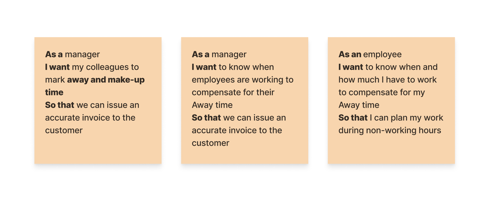
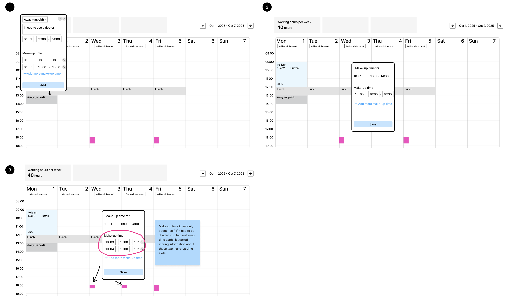
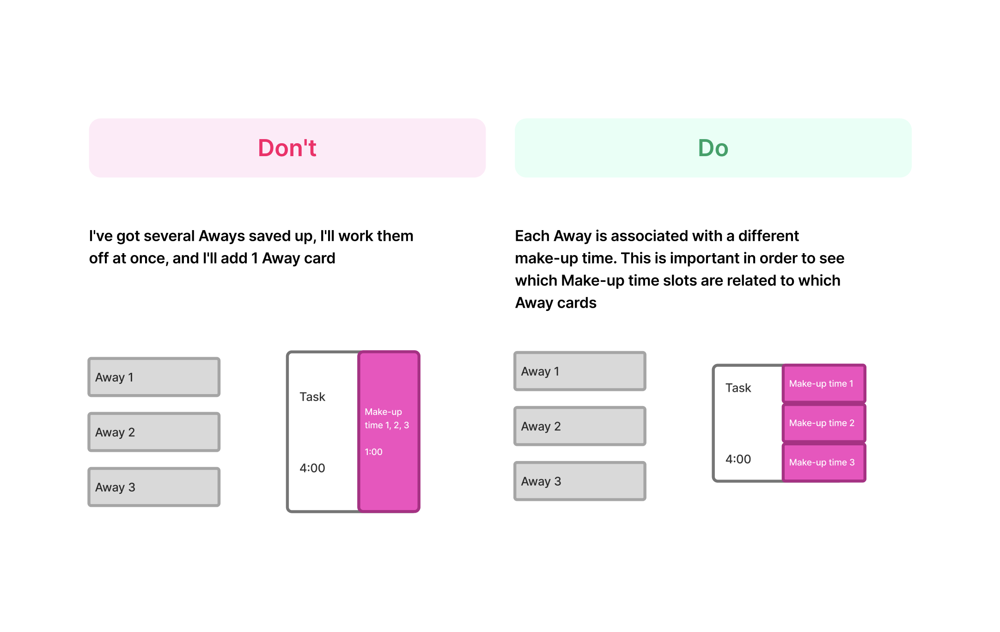
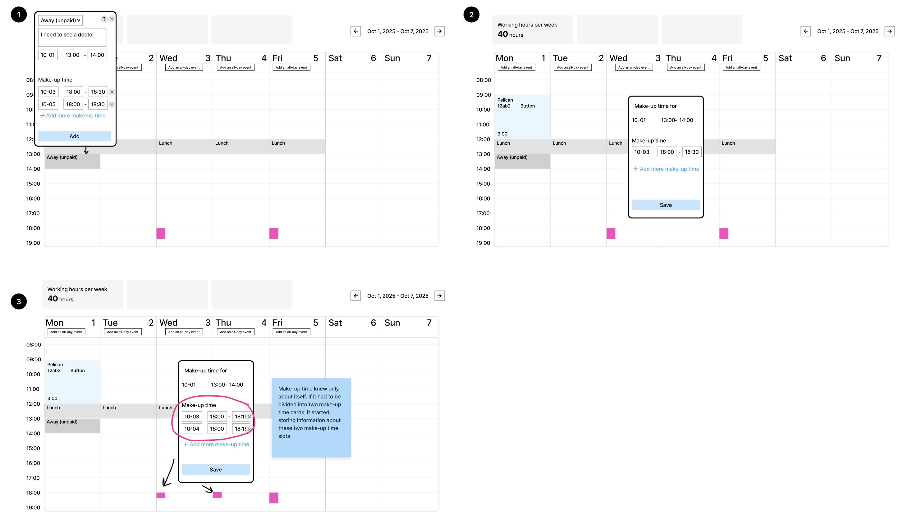
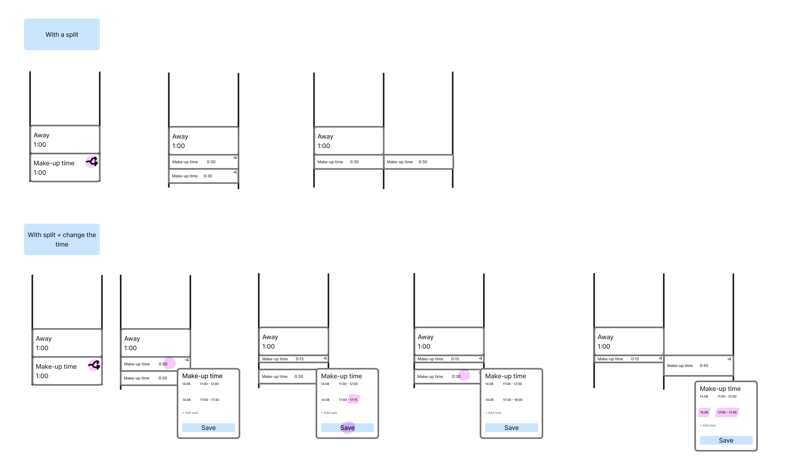
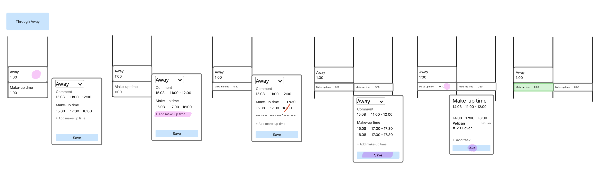
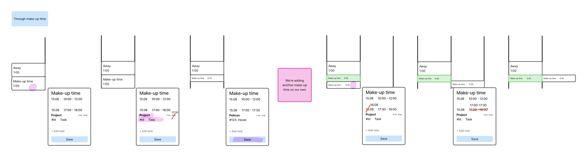
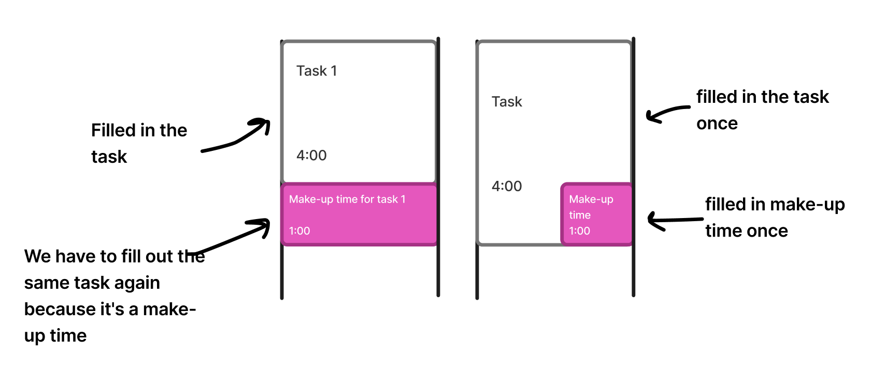

# Make-up time

## Status
Proposed (2025-12-04)

## Context

## Decision
Clicking on Away or Make-up time opens the same Away event so that when clicking on any of the related events, the user can edit any related event.

When clicking on Away, everything can be edited. By clicking on Make-up time, the event type and away time is in read-only mode, but make-up time can be edited.

## Alternatives

### Option 1

### Option 2

### Option 3

### Option 4

## Pros
1. No need to fill in repetitive information.

2. No information overload. Each functionality has its own place, away/make-up time and task information are separated.
3. No nesting, make-up time is easy to edit.
