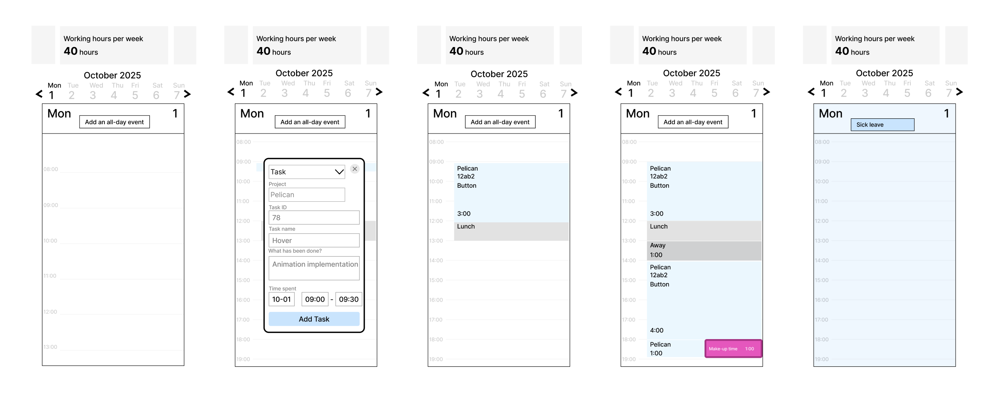
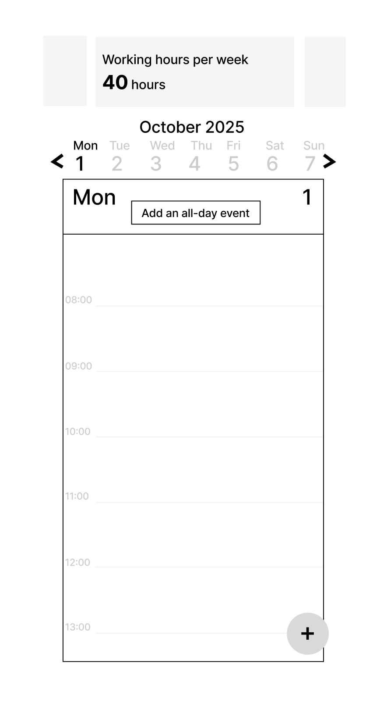

# Mobile version

## Status
Accepted (2025-12-10)

## Context
A mobile version is crucial, so that the time tracker can be used from any device.

## Decision

The mobile version reuses all the elements from the desktop version as much as possible. An event is added by clicking on an empty area of the desired time slot. The navigation between days and weeks is different on mobile compared to desktop, and mobile uses the day view.

## Alternatives

### Adding a card using a button

The user can add an event through the tracking area and through the button. When clicking on the button, the system by default offers the first untracked time slot for half an hour during working hours (e.g. 08:00-08:30). If all working time is tracked, the system offers the slot immediately after it in the non-working time. If the 08:30-12:00 slot is tracked, the system offers 08:00-8:30 by default.

How to find out the first free slot? At first the working hours can be hardcoded on the backend. Later, we’ll add a module with the work schedule of each employee.

## Consequences

We use the YAGNI principle. We don't add a button that duplicates the functionality (refusal of redundant functionality). Maybe that's not what we need at all.
