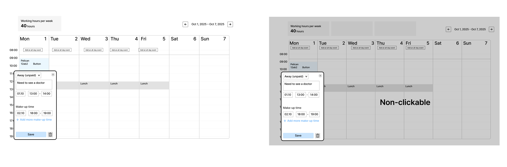

# Modal window

## Status
Accepted (2025-12-10)

## Context
A modal window or popup is needed to add events.

## Decision
The event card is a modal window, it blocks interaction with the rest of the time tracker. We can close the modal window by clicking the Close or the Save button (and other text buttons). In the next iterations we plan to refine the modal window behavior using alternative solutions.

We don't need to work on the positioning of the window at this stage, it will be worked out in the design phase. Now the window is displayed over the tracked time or day. If positioning is somehow implemented in the ready package, no need to change it.

## Alternatives
At the moment, we go for the solution which is the simplest and fastest to develop, and there is no need to handle various save cases. In the next iteration we can complicate this solution and make it a popup without blocking interaction with the background. Presumably without blocking the background we will be able to improve UX.

### Option 1
1. If we don't fill / edit anything in the card and click outside the popup, it will close without saving.
2. If we fill / edit even one field (name, time, etc.) and click outside the popup, it will close and automatically save the event.
3. With popup, we can switch between events without closing the cards.

### Option 2
1. If we fill out all fields in the card and click outside the popup, a modal window will appear.
2. If we fill in some of the fields and click outside the popup, the card will close without saving.

This option works better for short forms with 2-3 fields, where losing an incomplete result is not a big deal.

### Option 3
If we don't fill / edit anything in the card and click outside the popup, it's still saved.

## Pros
1. Simple logic, faster to implement.
2. Saves from losing filled in information when misclicking.

## Cons
1. Locking interaction with the time tracker may be confusing.
2. Can't switch quickly between events.
