# Overtime

## Status
Accepted (2025-12-10)

## Context

Cases:
1. Deadlines are burning, it is Friday and the manager asks you to overtime on Saturday.
2. A release is due on Thursday afternoon, but the task is still not closed on Wednesday evening, so everyone stays late to finalize.
3. The client asks to do the release in the evening, so everyone stays late after work until the release is done.
4. A employee is on sick leave, the prod is down. The issue is very critical and needs to be fixed while on sick leave.

In the future we plan to introduce paid overtimes, we will need a suitable event for it.

Overtime is a separate event because it is important for the manager to see that it is overtime and not make-up time for being late for example.

## Decision
Similarly to Make-up time, Overtime and Time-off share one event, which contains information about the Overtime and all Times-off linked to this Overtime. The Overtime event allows editing all the fields, the Time-off event allows editing only the Time-off periods.

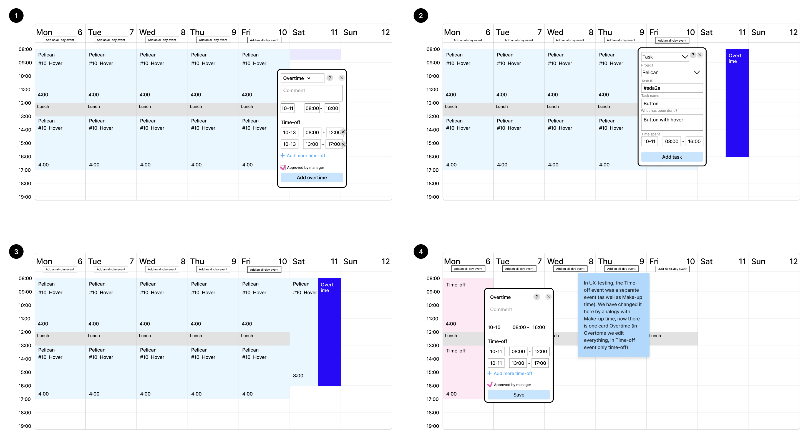

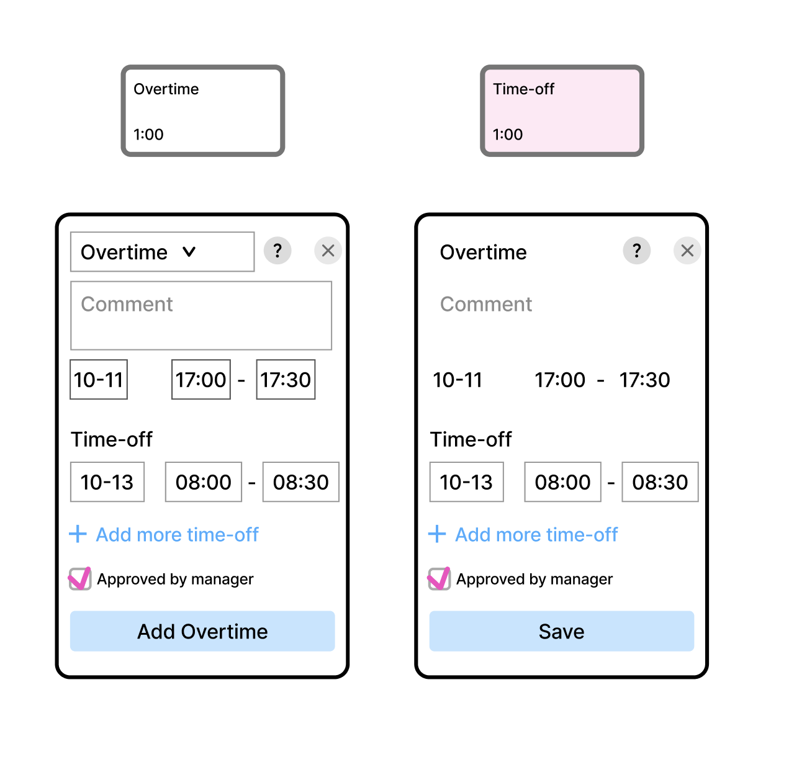

### What is NOT overtime?
An employee tracked tasks before lunchtime, then at lunchtime they took sick leave starting from today. The tracked tasks are not considered overtime, because overtime must be agreed upon in advance.
Tasks completed during non-working hours on your own initiative.

### What is overtime?
An employee took sick leave. The manager asked them to complete an urgent task on sick leave. There will be an agreed overtime next to the task in the time-tracker interface, which can be used later as time-off.

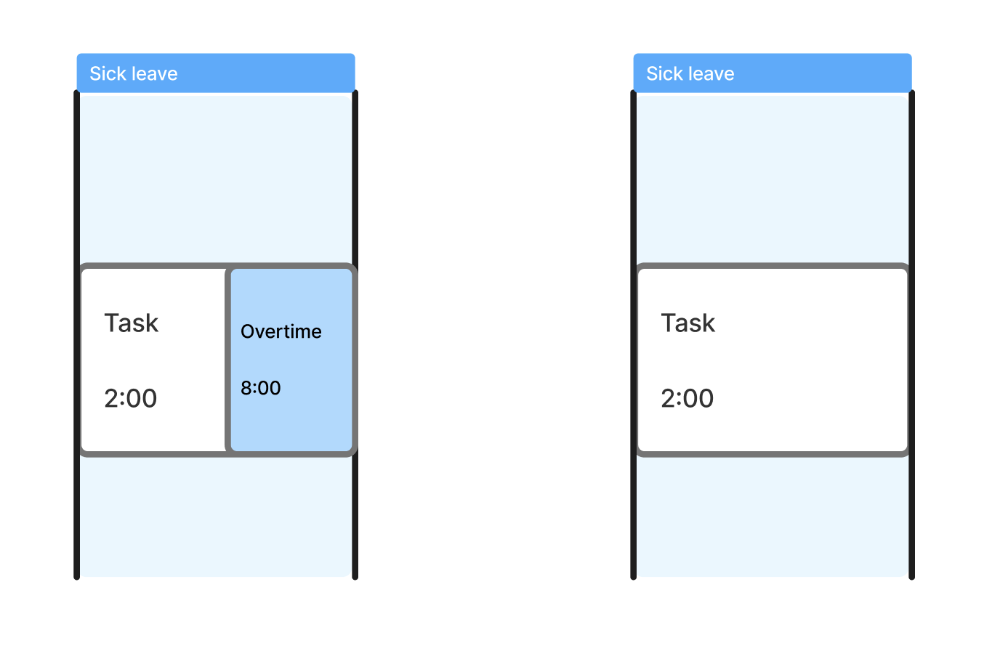

### Filling order

In the normal flow, the sequence of actions is as follows:
1. Schedule and agree overtime.
2. Mark overtime and time-off in the tracker.
3. Work on the task.
4. Track the task in the tracker.

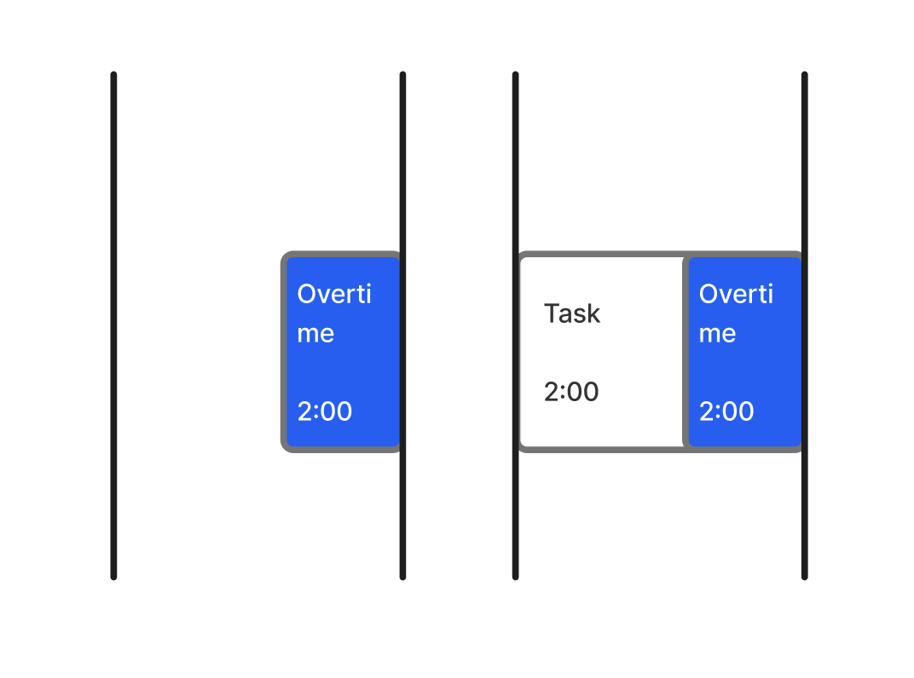

However, there may be a situation when we first add a task and then want to add an overtime. For example, cases 2 and 3 from the context. In the selected package, there is an empty space on the right of the event, and clicking on it  adds an event for the same time slot. We need to add an overtime clicking on this space, but make sure that it doesn’t split the day into 2 events, and the overtime event overlays the task (as in the normal flow).

Important: when clicking on such an area, only the Overtime card can be added. We don't need to add Make-up time in this way, because it is added from an Away card, and all other types of events cannot overlap each other.

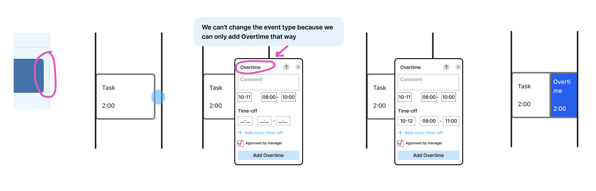

## Alternatives

### Option 1
Like with the alternative option of Make-up time, Time-off only contains information about its own time and does not know anything about Times-off tied to the same Overtime, so it was decided to abandon this option. Also in this case the Overtime card didn’t display the overtime label, so it was decided to improve it.

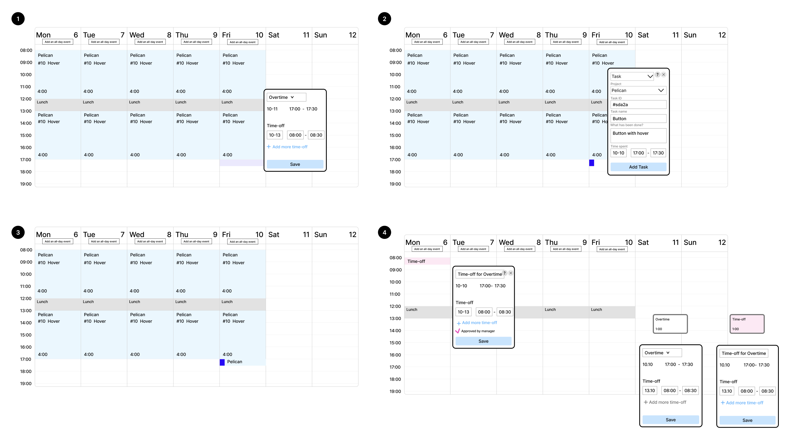

### Option 2
Details on overtime and task are filled in one card. We had the following hypotheses with this option:
1. It is easier to fill in all the information in one card than in two different cards.
2. It is easier to manage time changes in one card.

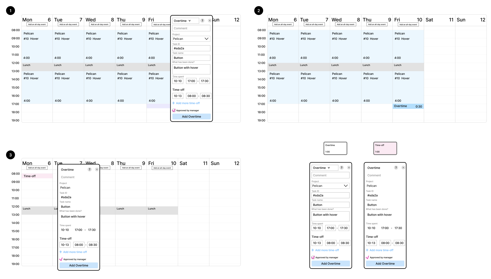

### Option 3
In the future, the system itself will prompt the user to set the time-off. 

### Testing the performance of solutions
This section shows a schematic and simplified comparison of two options (Decision and Option 2) in different cases.

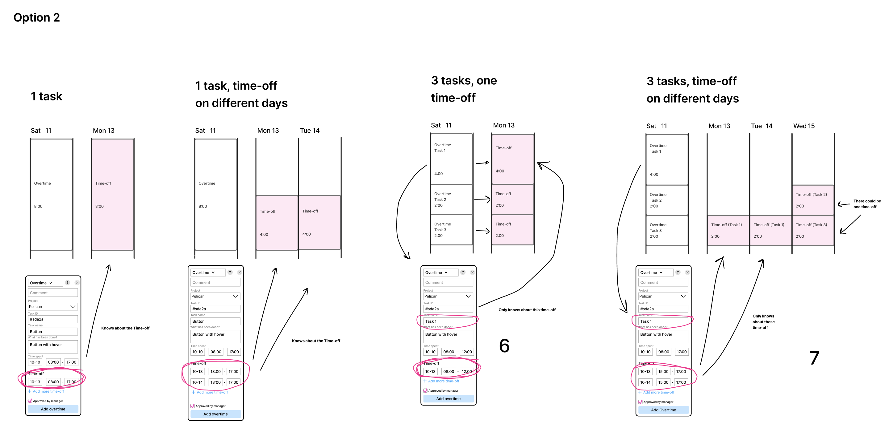

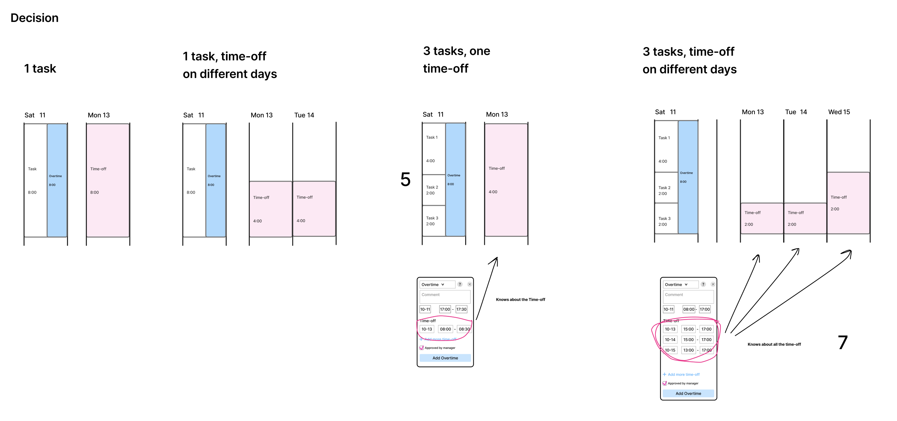

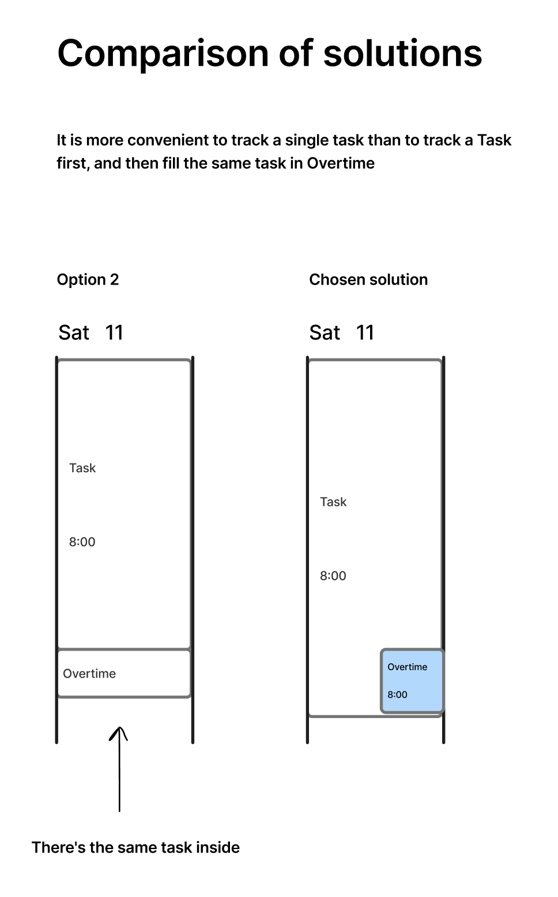

## Pros
1. In the selected solution, the manager immediately sees that there is an overtime and the tasks performed during it.
2. Number of clicks.
3. Workability in all cases.
4. No mixing information: task and overtime/time-off are separated.

## Cons

1. In the selected solution the user needs to be in two contexts: first create the Overtime, then the Task. There is an assumption that switching between two contexts is more complicated than filling in one card.
2. When working with two cards, there may be problems fitting time together. For example, if we want to reduce the Overtime, we need to reduce the time in the Task as well, otherwise there will be a discrepancy. We can try to solve this problem using the widget.

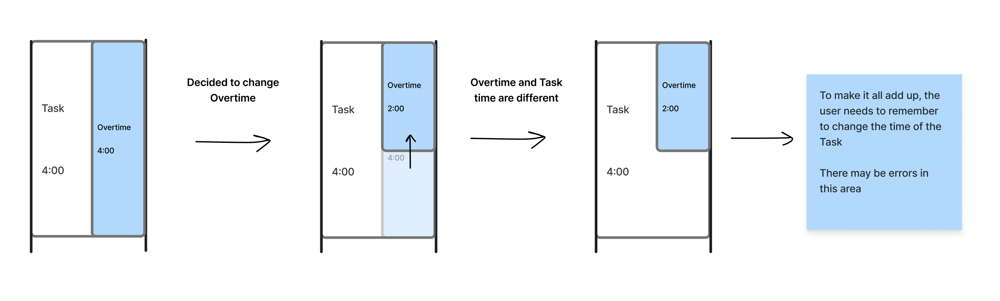
