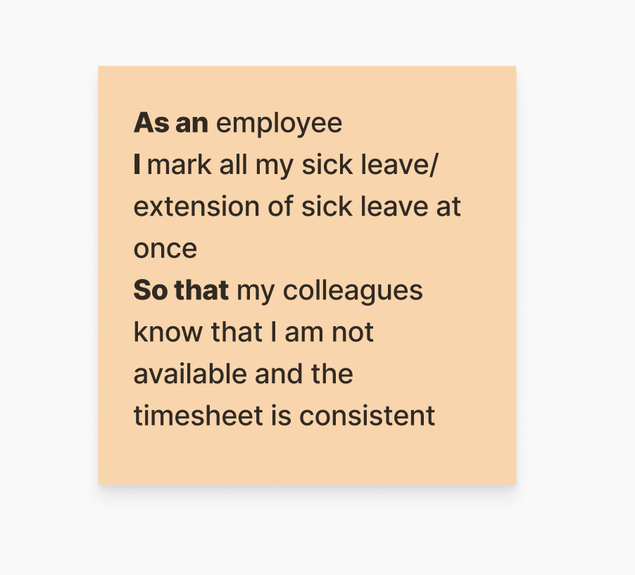
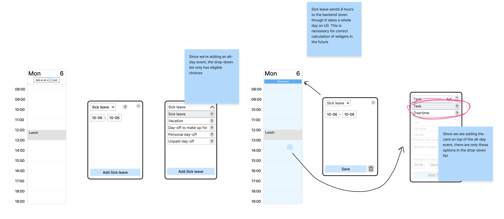
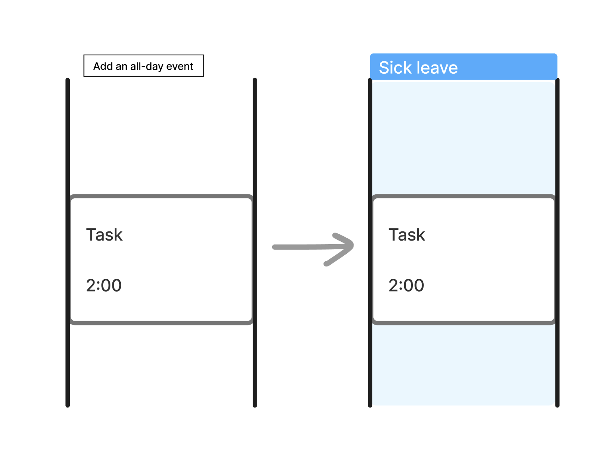
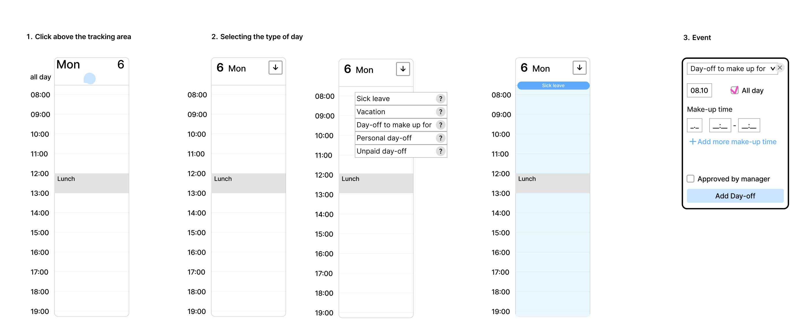
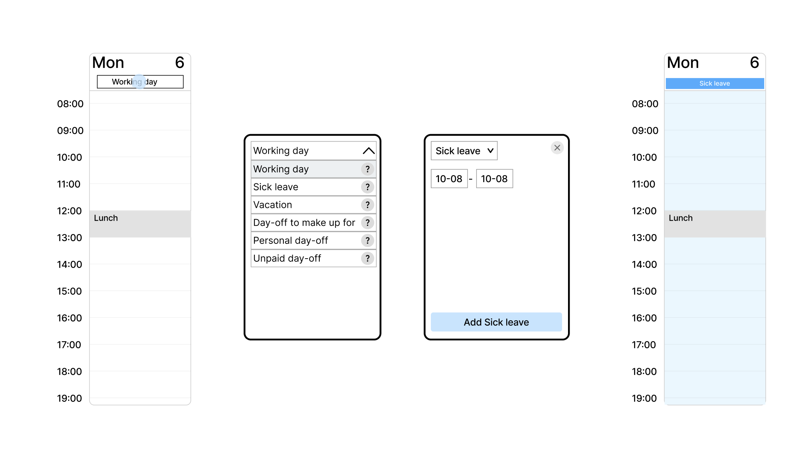

# Sick leave

## Status
Proposed (2025-12-04)

## Context

The user story in terms of meaning consists of several parts:
1. I mark sick leave.
2. My colleagues know that I am not available.
3. Timesheet is accurate.

In order to accomplish items 2-3, we need to collect information about who goes on sick leave and when, i.e., accomplish item 1 and make the functionality to mark sick leave.

In the 1st iteration, it is important to focus on point 1 and get all the necessary data on sick leave, so that we can then use this data to do the rest of the points and see the status and analytics. 

Item 2 doesn’t imply looking at other people's time trackers. We will work on this in the next iteration.

## Decision
In the prototype phase, the user can add an all-day event using a button in the day header. So far we have chosen the simplest option to indicate this action. At the design stage, we will think which component from the alternatives fits better and use it instead of the button.

At the moment we can only add one all-day event per day within one day. We can't put both sick leave and day-off on the same day, for example.

### Case: I track tasks in my tracker until lunch, at lunch I go to the doctor and take sick leave starting today
If there are already tracked tasks in the day, we can still add an event for the day (sick leave). After that the tracker will display both an event for the day (sick leave) and the tasks tracked before lunch. Completed tasks will not be considered as overtime (see Overtime).

## Alternatives

### Adding process
There are a few options how we can add an all-day event. During the design phase, we will work through this step and possibly choose some of the options below.

### Button
The disadvantage of this option is that we can put a working day in the middle of the sick leave and thus break it up. In the chosen solution, the sick leave is solid.

### Adding sick leave when a task has already been added
The original idea was to avoid overlapping events. If we want to add an all-day event, we must first clear the day of all other events. We rejected this option, because in this case we would lose completed tasks, and information on tasks is important to understand how much time is spent on the project.
