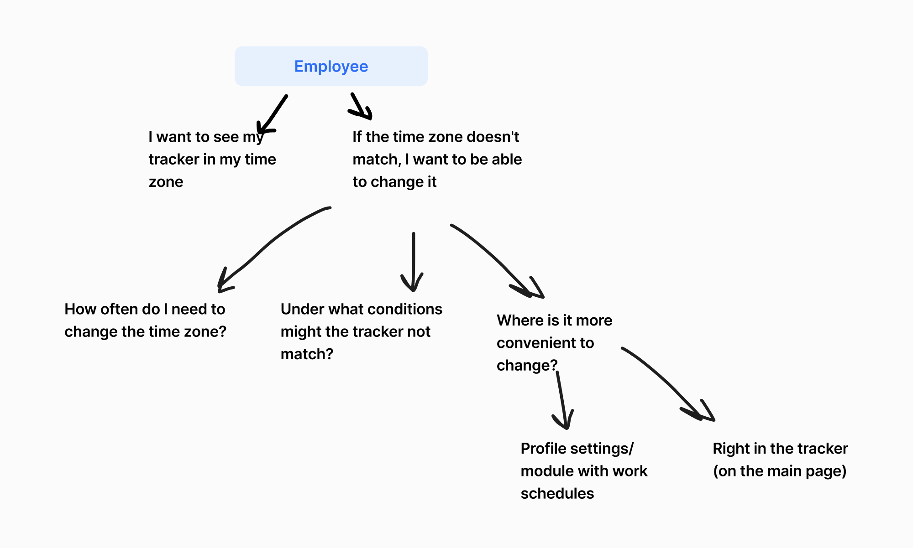
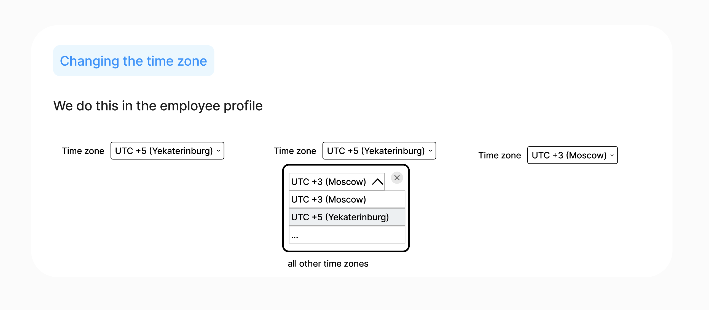
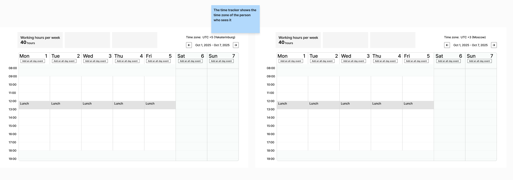
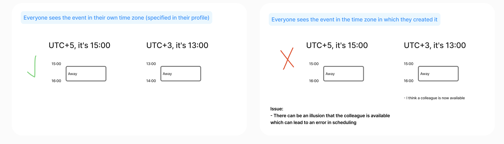
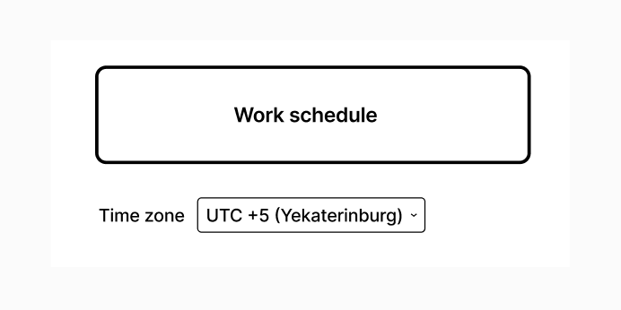
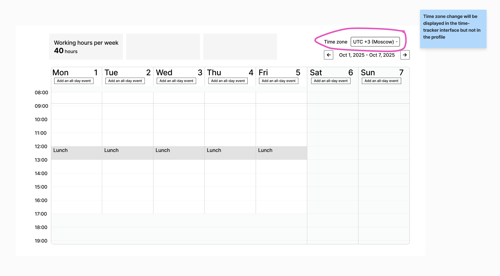

# Time zone

## Status
Proposed (2025-12-05)

## Context

## Decision

1. When a user logs in for the first time, the default time zone is Chelyabinsk (Yekaterinburg UTC+5).
2. An employee can change the time zone in their profile to any convenient one. The time zone is saved in the employee's profile. Example: if an employee has selected a time zone on desktop and then logs in from another device, this device will display the time zone selected on desktop.
3. Editing the time zone will be available on UI in the user profile, but which module/database it is saved in, is up to developers.
4. The time tracker will display selected time zone to make it easier to navigate.
5. For the drop-down list we can take some ready-made libraries with all time zones.

Reasons:
1. Most employees work in Chelyabinsk time zone.
2. It is easier to set the default time zone at once, because this setting will be stored in the database on the server, so it will be easier to specify the time zone at once than to leave it empty and at the first login to determine the time zone of the device (alternative 1).
3. We edit the time zone in the profile, because the time zone changes rarely (once in a few months for remote workers, almost never for employees from Chelyabinsk), so we can put this functionality out of sight.
4. From a UX perspective, it is useful to store time zone details in the profile to ensure continuity of the experience of using the service, when changing devices, settings are saved and do not need to be re-entered.

### General rule
Set and display the time based on the selected time zone. Example: two employees with different time zones have the same event. Each employee sees the time of this event according to their time zone. 

Important: joint events and viewing other people's time trackers will be added in the next iteration. The general principle is described here in case it affects the service design now.

For now we make the simplest solution, then we can iteratively refine and complicate it, including alternatives.

## Alternatives

### Change in the work schedule module

### Change in the time tracker with a save

### Change in the time tracker without a save

It may be useful for a manager to toggle an employee's tracker from the employee's timezone to their own timezone (or conversely, depending on whose timezone will be the default one when viewing someone else's tracker) in order to:
1. See when the employee is available.
2. Send the correct invoice to the customer. For example, an employee tracked 2 hours from 22:00 to 24:00 on November 30, but the manager will see the entry on December 1 because of a different time zone.

This toggle is not saved anywhere, it just changes the display of the time tracker. After reloading the page, the tracker returns to the time zone set in the profile. 

Important: we will be able to improve and implement this alternative after we introduce the functionality of viewing other people's time trackers.

### Determine the time zone of the device automatically when we log in for the first time. The time zone is not set before the first login
This option is more flexible and adapts to the time zone of the employee's device so they don't have to edit it.
